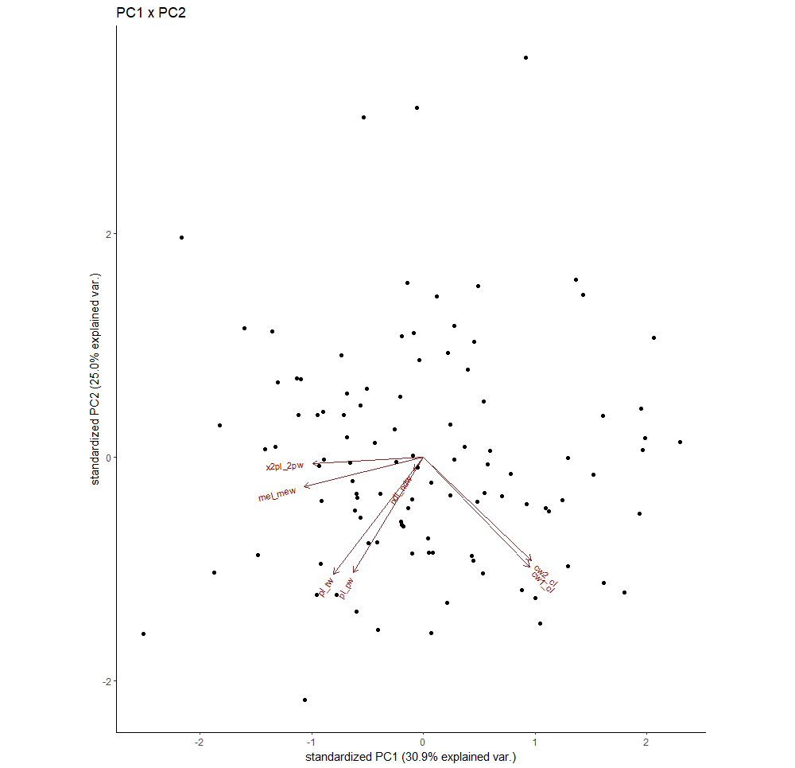

## PRINCIPLE COMPONENTS ANALYSIS (PCA)

## Tutorial

[datacamp](https://www.datacamp.com/tutorial/pca-analysis-r#!)

We will use Jerome's crab morphometric ratio data instead of the data used in the link

1. First, clone his [repo](https://github.com/Ph-IRES/uy), then open `uy/data_wrangling_vis.R` in R studio

```bash
git clone git@github.com:Ph-IRES/uy.git
```

2. Then run lines 1-56 in `data_wrangling_vis.R`.  This will create the tibble `data_lai_ratios` from his excel data.  This will be used for the PCA

3. Run the Principle Components Analysis with `prcomp()`, store the results in a variable called `lai_ratio.pca`, and use `summary()` to view the results.

```r
lai_ratio.pca <- 
  prcomp(data_lai_ratios %>%
           select(-code:-baranguay,
                  -mal_dal), 
         center = TRUE,
         scale. = TRUE)

summary(lai_ratio.pca)
```

You should obtain the following output:

	```
	Importance of components:
							  PC1    PC2    PC3    PC4     PC5     PC6     PC7
	Standard deviation     1.4712 1.3224 1.0537 0.9929 0.67605 0.57038 0.45645
	Proportion of Variance 0.3092 0.2498 0.1586 0.1409 0.06529 0.04648 0.02976
	Cumulative Proportion  0.3092 0.5590 0.7176 0.8585 0.92376 0.97024 1.00000
	```

PC1 is Principle Component 1, which will always explain the most variance (stdev is sqrt(variance)).

4. Now we use `ggbiplot()` to visualize the results stored in `lai_ratio.pca`.  Note that we demonstrate a few different features of `ggbiplot()` and that it works with typical `ggplot` functions.

```r
ggbiplot(lai_ratio.pca) +
  theme_classic() +
  labs(title = "PC1 x PC2")
```



```r
ggbiplot(lai_ratio.pca,
         labels = data_lai_ratios %>%
           pull(code)) +
  theme_classic() +
  labs(title = "PC1 x PC2",
       subtitle = "Labeled with ID #s")
```


```r
ggbiplot(lai_ratio.pca,
         labels = data_lai_ratios %>%
           pull(code),
         ellipse = TRUE,
         groups = data_lai_ratios %>%
           mutate(province = str_remove(baranguay,
                                        "^.*, ")) %>%
           pull(province)) +
  theme_classic() +
  labs(title = "PC1 x PC2",
       subtitle = "Grouped by Province, With Ellipses")
```


```r
ggbiplot(lai_ratio.pca,
         labels = data_lai_ratios %>%
           pull(code),
         ellipse = TRUE,
         groups = data_lai_ratios %>%
           mutate(province = str_remove(baranguay,
                                        "^.*, ")) %>%
           pull(province),
         choices = c(3,4)) +
  theme_classic() +
  labs(title = "PC3 x PC4",
       subtitle = "Grouped by Province, With Ellipses")
```


```r
ggbiplot(lai_ratio.pca,
         labels = data_lai_ratios %>%
           pull(code),
         ellipse = TRUE,
         groups = data_lai_ratios %>%
           mutate(province = str_remove(baranguay,
                                        "^.*, ")) %>%
           pull(province),
         choices = c(3,4),
         var.axes = FALSE) +
  theme_classic() +
  labs(title = "PC3 x PC4",
       subtitle = "Grouped by Province, With Ellipses, Variables Removed")
```


