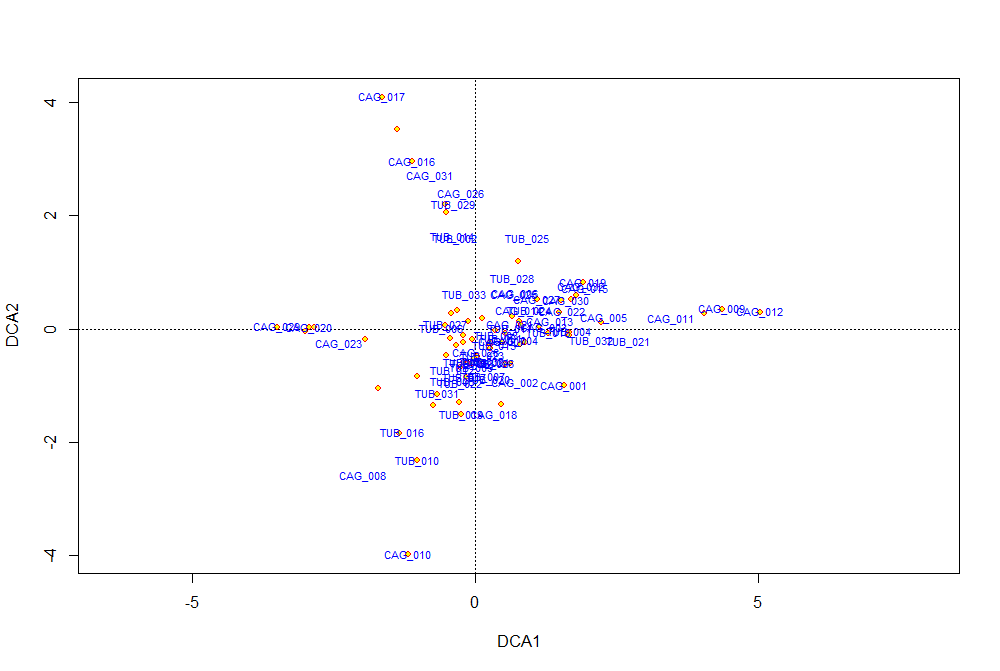
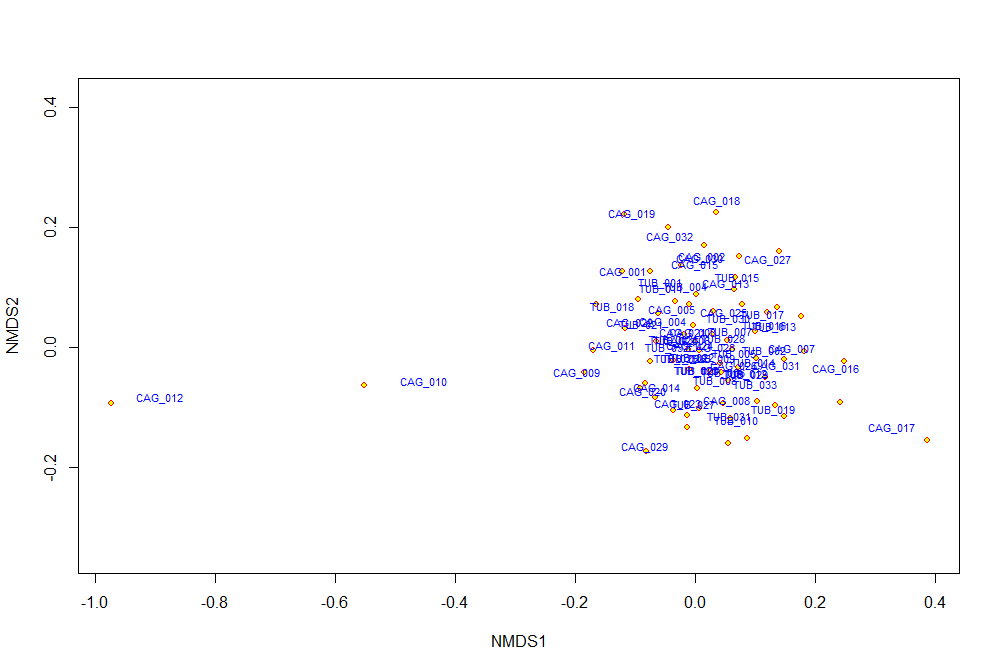
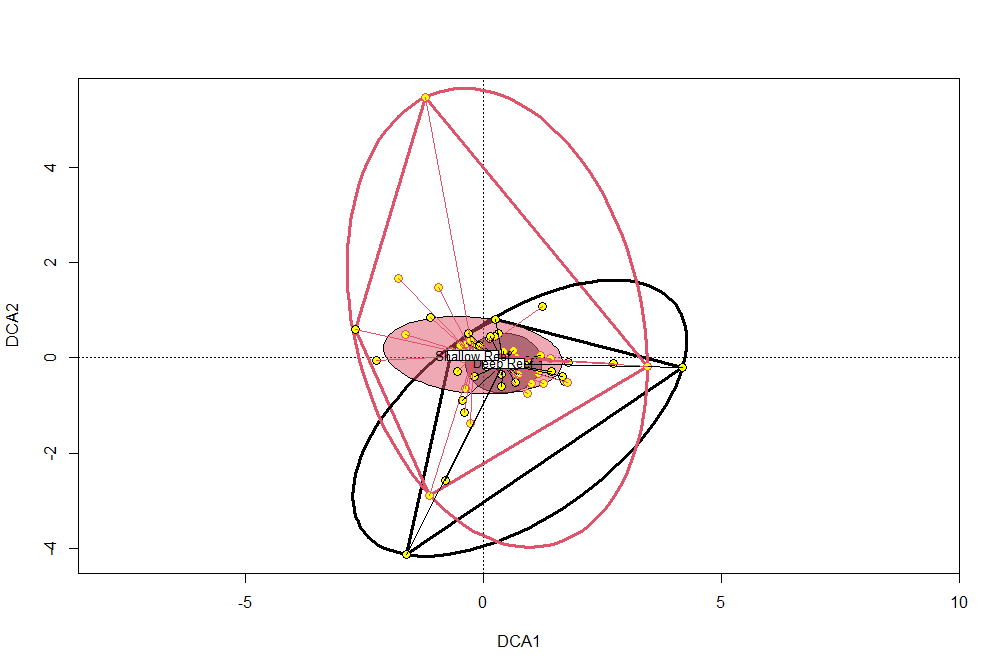
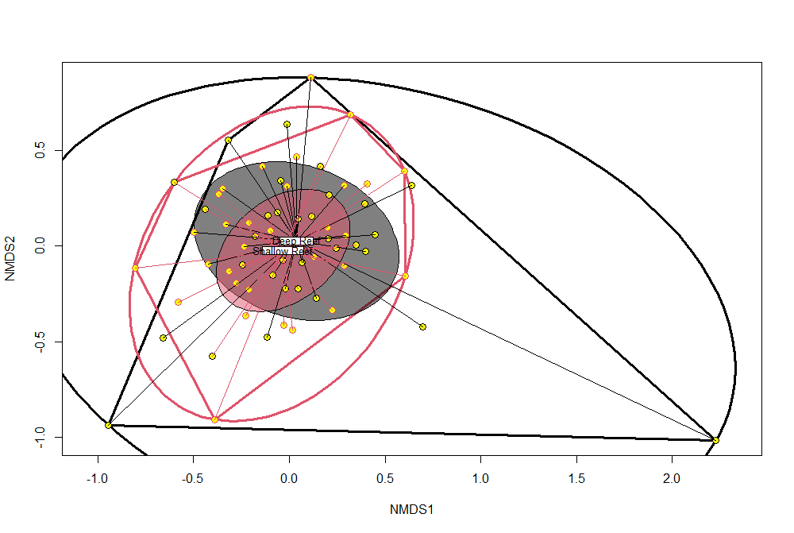
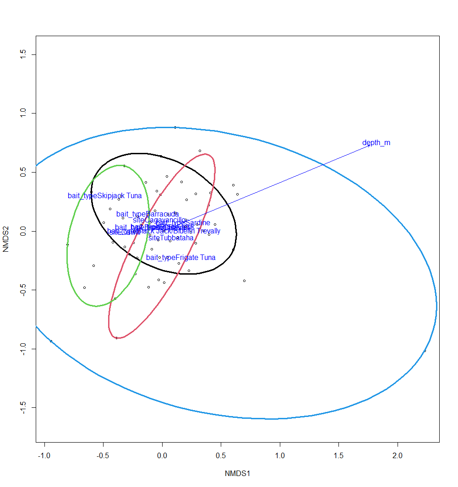
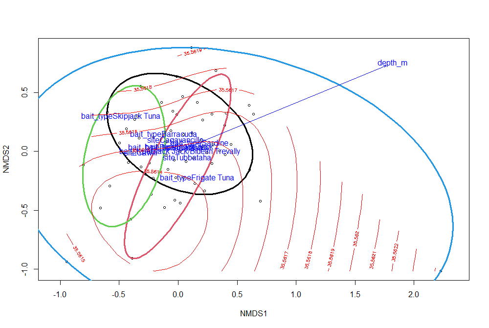

# BIODIVERSITY ANALYSIS

## R Packages

* [vegan](https://cloud.r-project.org/web/packages/vegan/index.html)
* [BiodiversityR](https://rdrr.io/cran/BiodiversityR/)
* [adiv](https://besjournals.onlinelibrary.wiley.com/doi/epdf/10.1111/2041-210X.13430)

## Other Tutorials

* https://www.mooreecology.com/uploads/2/4/2/1/24213970/vegantutor.pdf
* http://www.kembellab.ca/r-workshop/biodivR/SK_Biodiversity_R.html
* https://peat-clark.github.io/BIO381/veganTutorial.html

## Getting Started

1. Install `vegan` and any necessary dependencies 

	```
	> install.packages("vegan")
	WARNING: Rtools is required to build R packages but no version of Rtools compatible with the currently running version of R was found. Note that the following incompatible version(s) of Rtools were found:

	  - Rtools 3.4 (installed at C:\RBuildTools\3.4)
	  - Rtools 3.5 (installed at C:\RBuildTools\3.5)

	Please download and install the appropriate version of Rtools before proceeding:

	https://cran.rstudio.com/bin/windows/Rtools/
	Installing package into ‘C:/Users/cbird/AppData/Local/R/win-library/4.2’
	(as ‘lib’ is unspecified)
	also installing the dependency ‘permute’

	trying URL 'https://cran.rstudio.com/bin/windows/contrib/4.2/permute_0.9-7.zip'
	Content type 'application/zip' length 225001 bytes (219 KB)
	downloaded 219 KB

	trying URL 'https://cran.rstudio.com/bin/windows/contrib/4.2/vegan_2.6-2.zip'
	Content type 'application/zip' length 3700068 bytes (3.5 MB)
	downloaded 3.5 MB

	package ‘permute’ successfully unpacked and MD5 sums checked
	package ‘vegan’ successfully unpacked and MD5 sums checked

	The downloaded binary packages are in
		C:\Users\cbird\AppData\Local\Temp\RtmpaKbQtZ\downloaded_packages
	>
	```

	Note that Rtools is required but not found, so I followed the instructions given above to install Rtools

2. Wrangle data into format compatible with vegan.

	For the species count data, each column is a taxon and each row is a unique site or observation

	We will use the count data from the `salvador` repo which is already here in this directory.  
	
	Open `data_wrangling_vis_salvador.R` in R studio and run lines 1-52
	
	Now we can wrangle the tibble `data` into vegan format
	
	```r
	data_vegan <-
	  data %>%
	  # make unique taxa
	  mutate(taxon = str_c(family,
						   genus,
						   species,
						   sep = "_")) %>%
	  # sum all max_n counts for a taxon and op_code
	  group_by(taxon,
			   op_code) %>%
	  summarize(sum_max_n = sum(max_n)) %>%
	  ungroup() %>%
	  # convert tibble from long to wide format
	  pivot_wider(names_from = taxon,
				  values_from = sum_max_n,
				  values_fill = 0) %>%
	  # sort by op_code
	  arrange(op_code) %>%
	  # remove the op_code column for vegan
	  dplyr::select(-op_code)
	```

	For the metadata, each row must be in same order as in data tibble above:
	
	```r
	metadata_vegan <-
	  data_all %>%
	  # make unique taxa
	  mutate(taxon = str_c(family,
						   genus,
						   species,
						   sep = "_")) %>%
	  # sum all max_n counts for a taxon and op_code
	  group_by(taxon,
			   op_code,
			   site,
			   survey_area,
			   habitat,
			   lat_n,
			   long_e,
			   depth_m,
			   bait_type) %>%
	  summarize(sum_max_n = sum(max_n)) %>%
	  ungroup() %>%
	  # convert tibble from long to wide format
	  pivot_wider(names_from = taxon,
				  values_from = sum_max_n,
				  values_fill = 0) %>%
	  # sort by op_code
	  arrange(op_code) %>%
	  # remove the op_code column for vegan
	  dplyr::select(op_code:bait_type) %>%
	  mutate(site_code = str_remove(op_code,
									"_.*$"))
	```

	and lastly, we "attach" the metadata to the data

	```r
	attach(data_vegan.env)
	```

## Ordination

We are following the [Vegan: an introduction to ordination](https://cloud.r-project.org/web/packages/vegan/vignettes/intro-vegan.pdf) vignette, but replacing the `dune` data set with `data_vegan` from the `salvador` repo.

You can consult the [`vegan` manual](https://cloud.r-project.org/web/packages/vegan/vegan.pdf) where the vignette does not go into enough depth.

Note that `vegan` is not `tidyverse` compatible, meaning that its functions are meant to be used with `base R` commands. If you want to use `ggplot`, you will have to harness the vegan output yourself, which really is not very difficult.  Just realize that the `plot` command is not `ggplot` and not compatible with `ggplot`.

```r
# Detrended correspondence analysis
ord <- decorana(data_vegan)
ord
summary(ord)
#boring plot
plot(ord)
```
	

The symbols represent the sites (black circles) and the taxa (red +)

```r
#fancier plot
plot(ord, type = "n")
points(ord, display = "sites", cex = 0.8, pch=21, col="black", bg="yellow")
text(ord, display = "spec", cex=0.7, col="red")
```


The sites are black circles and the taxa are spelled out in red.

```r
#fanciest plot
plot(ord, disp="sites", type="n")
ordihull(ord, habitat, col=1:2, lwd=3)
ordiellipse(ord, habitat, col=1:2, kind = "ehull", lwd=3)
ordiellipse(ord, habitat, col=1:2, draw="polygon")
points(ord, disp="sites", pch=21, col=1:2, bg="yellow", cex=1.3)
ordispider(ord, habitat, col=1:2, label = TRUE)
```


Color coded by habitat, where deep reef is black and shallow reef is red.

---

### Non-metric multidimensional scaling

```r
ord <- metaMDS(data_vegan)
ord
summary(ord)
#fanciest plot
plot(ord, disp="sites", type="n")
ordihull(ord, habitat, col=1:2, lwd=3)
ordiellipse(ord, habitat, col=1:2, kind = "ehull", lwd=3)
ordiellipse(ord, habitat, col=1:2, draw="polygon")
points(ord, disp="sites", pch=21, col=1:2, bg="yellow", cex=1.3)
ordispider(ord, habitat, col=1:2, label = TRUE)
```



---

### Fitting Environmental Variables

Let us test for an effect of site and depth on the NMDS

```r
ord.fit <- 
  envfit(ord ~ depth_m + site + bait_type, 
         data=data_vegan.env, 
         perm=999,
         na.rm = TRUE)
ord.fit
plot(ord, dis="site")
ordiellipse(ord, site, col=1:4, kind = "ehull", lwd=3)
plot(ord.fit)
```


Ellipses represent the sites.

Add the fitted surface for depth to the ordination plot

```r
ordisurf(ord, depth_m, add=TRUE)

```


