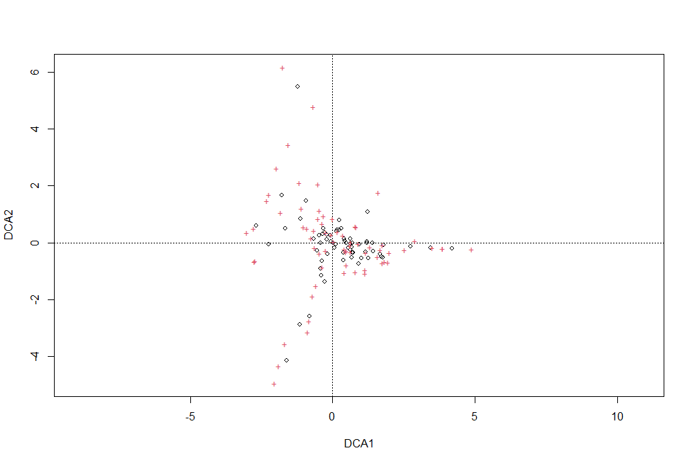
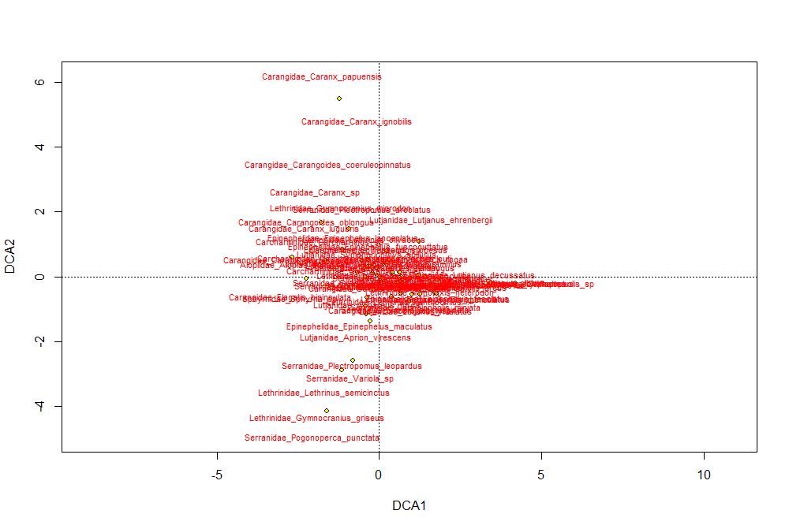
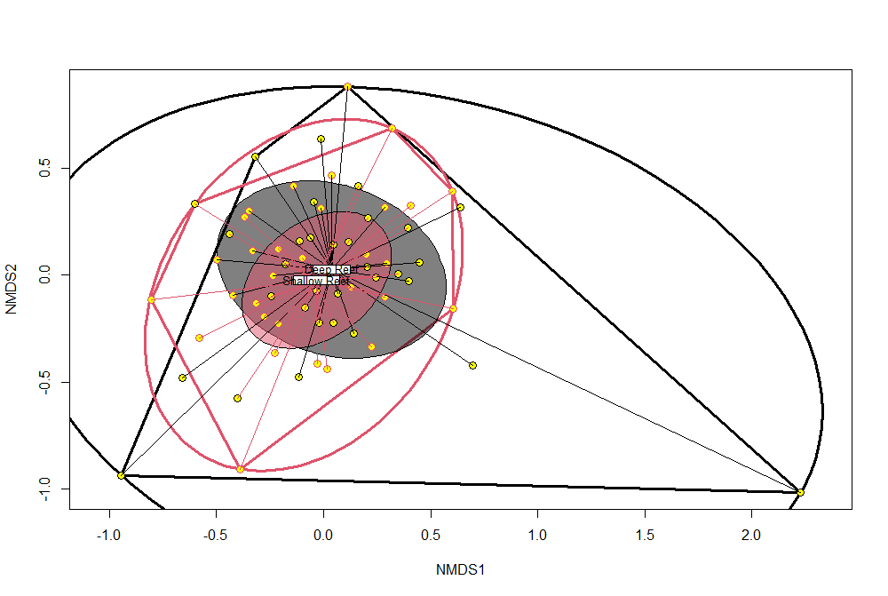
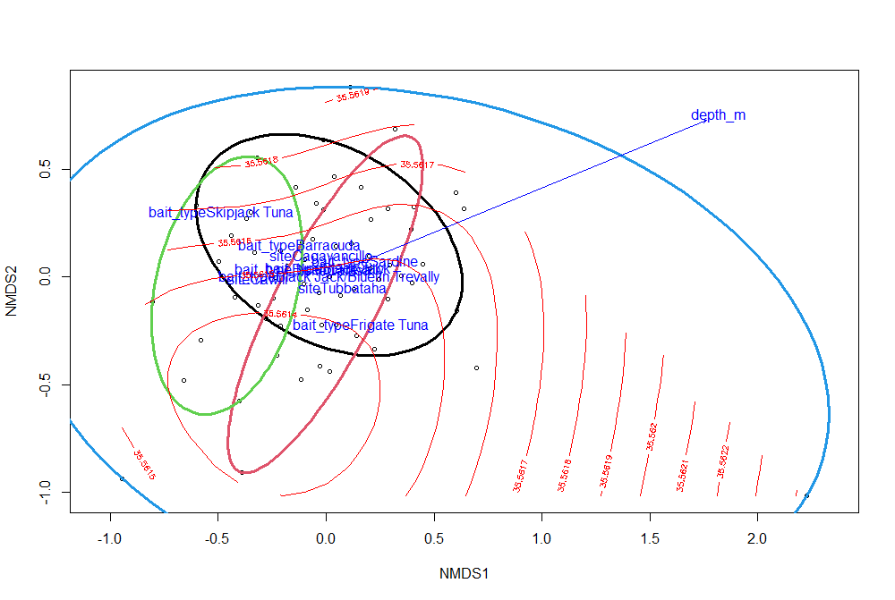

# ORDINATION

We are following the [Vegan: an introduction to ordination](https://cloud.r-project.org/web/packages/vegan/vignettes/intro-vegan.pdf) vignette, but replacing the `dune` data set with `data_vegan` from the `salvador` repo.

You can consult the [`vegan` manual](https://cloud.r-project.org/web/packages/vegan/vegan.pdf) where the vignette does not go into enough depth.

Note that `vegan` is not `tidyverse` compatible, meaning that its functions are meant to be used with `base R` commands. If you want to use `ggplot`, you will have to harness the vegan output yourself, which really is not very difficult.  Just realize that the `plot` command is not `ggplot` and not compatible with `ggplot`.

---

## ORDINATION: Detrended correspondence analysis

```r
ord <- decorana(data_vegan)
ord
summary(ord)
#boring plot
plot(ord)
```
	

The symbols represent the sites (black circles) and the taxa (red +)

```r
#fancier plot
plot(ord, type = "n")
points(ord, display = "sites", cex = 0.8, pch=21, col="black", bg="yellow")
text(ord, display = "spec", cex=0.7, col="red")
```


The sites are black circles and the taxa are spelled out in red.

```r
#fanciest plot
plot(ord, disp="sites", type="n")
ordihull(ord, habitat, col=1:2, lwd=3)
ordiellipse(ord, habitat, col=1:2, kind = "ehull", lwd=3)
ordiellipse(ord, habitat, col=1:2, draw="polygon")
points(ord, disp="sites", pch=21, col=1:2, bg="yellow", cex=1.3)
ordispider(ord, habitat, col=1:2, label = TRUE)
```


Color coded by habitat, where deep reef is black and shallow reef is red.

---

### ORDINATION: Non-metric multidimensional scaling

```r
ord <- metaMDS(data_vegan)
ord
summary(ord)
#fanciest plot
plot(ord, disp="sites", type="n")
ordihull(ord, habitat, col=1:2, lwd=3)
ordiellipse(ord, habitat, col=1:2, kind = "ehull", lwd=3)
ordiellipse(ord, habitat, col=1:2, draw="polygon")
points(ord, disp="sites", pch=21, col=1:2, bg="yellow", cex=1.3)
ordispider(ord, habitat, col=1:2, label = TRUE)
```



---

### ORDINATION: Fitting Environmental Variables

Let us test for an effect of site and depth on the NMDS

```r
ord.fit <- 
  envfit(ord ~ depth_m + site + bait_type, 
         data=data_vegan.env, 
         perm=999,
         na.rm = TRUE)
ord.fit
plot(ord, dis="site")
ordiellipse(ord, site, col=1:4, kind = "ehull", lwd=3)
plot(ord.fit)
```


Ellipses represent the sites.

Add the fitted surface for depth to the ordination plot

```r
ordisurf(ord, depth_m, add=TRUE)

```



---

### ORDINATION: Constrained Ordination

Example with CCA, constrained or “canonical” correspondence analysis

```r
ord <- cca(data_vegan ~ depth_m + site , data=data_vegan.env)
ord
plot(ord, dis="site")
points(ord, disp="site", pch=21, col=1:2, bg="yellow", cex=1.3)
ordiellipse(ord, site, col=1:4, kind = "ehull", lwd=3)
```

---

### ORDINATION: Constrained Ordination Significance Tests

```r
anova(ord)
```
	Permutation test for cca under reduced model
	Permutation: free
	Number of permutations: 999

	Model: cca(formula = data_vegan ~ depth_m + site, data = data_vegan.env)
			 Df ChiSquare      F Pr(>F)    
	Model     4    1.2457 1.6115  0.001 ***
	Residual 60   11.5946                  
	---
	Signif. codes:  0 ‘***’ 0.001 ‘**’ 0.01 ‘*’ 0.05 ‘.’ 0.1 ‘ ’ 1

```r
anova(ord, by="term", permutations=999)
```
	Permutation test for cca under reduced model
	Terms added sequentially (first to last)
	Permutation: free
	Number of permutations: 999

	Model: cca(formula = data_vegan ~ depth_m + site, data = data_vegan.env)
			 Df ChiSquare      F Pr(>F)   
	depth_m   1    0.3114 1.6114  0.002 **
	site      3    0.9343 1.6116  0.002 **
	Residual 60   11.5946                 
	---
	Signif. codes:  0 ‘***’ 0.001 ‘**’ 0.01 ‘*’ 0.05 ‘.’ 0.1 ‘ ’ 1

```r
anova(ord, by="mar", permutations=999)
```
	Permutation test for cca under reduced model
	Marginal effects of terms
	Permutation: free
	Number of permutations: 999

	Model: cca(formula = data_vegan ~ depth_m + site, data = data_vegan.env)
			 Df ChiSquare      F Pr(>F)    
	depth_m   1    0.1831 0.9476  0.575    
	site      3    0.9343 1.6116  0.001 ***
	Residual 60   11.5946                  
	---
	Signif. codes:  0 ‘***’ 0.001 ‘**’ 0.01 ‘*’ 0.05 ‘.’ 0.1 ‘ ’ 1

```r
anova(ord, by="axis", permutations=999)
```
	Permutation test for cca under reduced model
	Forward tests for axes
	Permutation: free
	Number of permutations: 999

	Model: cca(formula = data_vegan ~ depth_m + site, data = data_vegan.env)
			 Df ChiSquare      F Pr(>F)    
	CCA1      1    0.5233 2.7080  0.001 ***
	CCA2      1    0.3428 1.7740  0.042 *  
	CCA3      1    0.2374 1.2287  0.411    
	CCA4      1    0.1421 0.7354  0.931    
	Residual 60   11.5946                  
	---
	Signif. codes:  0 ‘***’ 0.001 ‘**’ 0.01 ‘*’ 0.05 ‘.’ 0.1 ‘ ’ 1

---

### ORDINATION: Conditioned or partial ordination

If there are covariates that we are not interested in testing the effect of, but we want to account for their impact on the response variables, we can partial out these covariates 

```r
ord <- cca(data_vegan ~ depth_m + site + Condition(bait_type), 
           data=data_vegan.env)
anova(ord, by="term", permutations=999)
```

	Permutation test for cca under reduced model
	Terms added sequentially (first to last)
	Permutation: free
	Number of permutations: 999

	Model: cca(formula = data_vegan ~ depth_m + site + Condition(bait_type), data = data_vegan.env)
			 Df ChiSquare      F Pr(>F)   
	depth_m   1    0.1778 0.9359  0.586   
	site      2    0.7661 2.0168  0.002 **
	Residual 55   10.4467                 
	---
	Signif. codes:  0 ‘***’ 0.001 ‘**’ 0.01 ‘*’ 0.05 ‘.’ 0.1 ‘ ’ 1

