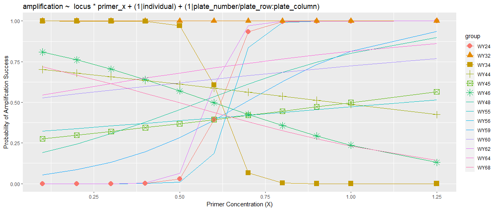

# TESTING HYPOTHESES WITH FIXED and MIXED MODELS

Under construction

---

## [Fixed Models](fixed_models_binom.md)

Is there an effect of fishing pressure on the size at which females transition to males in a reef associated fish?  This is an example of running a fixed effects model with `glm`. The data has a binomial response variable, a categorical fixed effect, and a continuous fixed effect.  
| Model Predictions | EMMeans |
| -------------- | -------------- |
| | |

---

## [Mixed Models](mixed_models_binom.md)

Is there an effect of primer concentration on the probability of amplification success among loci? This is an example of running a mixed effects model with `glmer`.  The data has a binomial response variable, a categorical fixed effect, a continuous fixed effect, and nested random effects.

