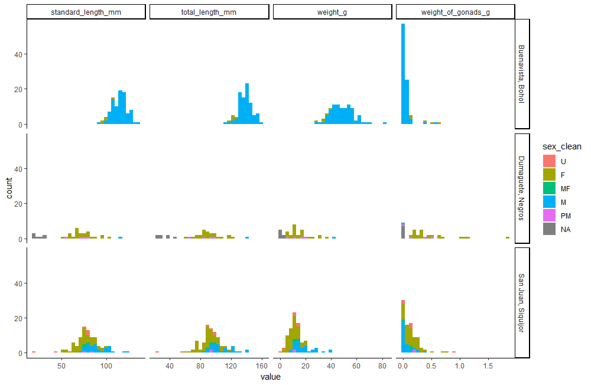

# TESTING HYPOTHESES WITH MIXED MODELS

Under construction

---

## Getting Started

Open [`miexed_models.R`](mixed_models.R) in Rstudio and run the `INITIALIZATION` section

NOTE: after loading these packages, you may find that tidyverse commands are affected. The solution is to add the appropriate package name before commands that break code such as `dplyr::select` if `select` doesn't work correctly anymore. This happens when multiple packages have the same command names. The last package loaded takes precidence, and your tidyverse commands break. You could load tidyverse last, but invariably, you will load a package after tidyverse that breaks one of its commands, so it's impossible to avoid this.

We will use Ingrids data set on sex change in _Halichores scapularis_ which has been saved as an R data structure (RDS) file. 

---

## Explore Your Data For the Hypothesis Tests

### basic ggplot plots
It is important to understand the nature of your data. Histograms can help you make decisions on how your data must be treated to conform with the assumptions of statistical models.


Fig 1. Histograms of fish measurements by location and sex.  U=immature, sex cannot be determined, F=female, MF=both sex organs, M=male, PM=primary male, NA= no observation made


Fig 2. Histograms of fish measurements by location and sex. The stages range from 0=immature sex undecipherable to 4=mature female to ...

Im noticing that the left skewed distribution of `weight_of_gonads_g` is quite different from the other metrics. It may have to be handled differently.

---

### fitdistrplus: An R Package for Fitting Distributions

`vis_dists()` is a function that I made in the FUNCTIONS section of this script.  It accepts the tibble and column name to visualize.

vis_dists() creates three figures


Fig 3. Histogram and cumulative distribution of `total_length_mm`


Fig 4. Cullen and Frey Graph of kurtosis vs square of skewness for `total_length_mm`. **I really like this one.**  This shows you which statistical distribution the data most closely resembles.  Here, the data is nearly log normal, but better fit by the beta distribution.


Fig 5. 4 additional plots that allow you to determine the distribution that most closely fits `total_length_mm`

---

## Identifying the Distribution Family for you Hypothesis Test

It is especially important to identify the correct statistical distribution for your **response variable**, so the plots above can be used to help with identifying the correct distribution family for that.

Here are some rules of thumb:
* Binomial
	* if your unit of observation falls into one of two categories, such as Male or Female, then your data is binomial
	* percentage and proportion data that can be converted to count data is binomial


---

## Make Visualization of Hypothesis Test

Here we will test for the effect of size on the sex of _Halichores scapularis_ among different locations.


Fig 6. Plots of fish sex (F=0, M=1) against total length.  Fit lines are logistic.

Some things to notice are that there are not many males from Dumaguete and not many females from Buenavista.  Consequently we might want to test some other hypotheses later. For example, testing for differences in total length by sex and location might be useful. But lets save this for later.

---

## [Fixed Effects Hypthesis Test](https://en.wikipedia.org/wiki/Fixed_effects_model)

If you only have variables that are [fixed](https://en.wikipedia.org/wiki/Fixed_effects_model) then we can use `glm()` to test your hypotheses.

Here we test for differences among locations in the probability that an individual is a male given the total length of the fish. We do not allow the slopes to vary among the sites.  This may be adventageous because sizes sampled differ among the sites and we might expect the slope of the lines to remain similar while the points of inflection vary.

```r
model <<- 
  glm(formula = female_male ~  total_length_mm + location, 
      family = distribution_family,
      data = data)
```

	Call:  glm(formula = female_male ~ total_length_mm + location, family = distribution_family, 
		data = data)

	Coefficients:
				   (Intercept)             total_length_mm   locationDumaguete, Negros  locationSan Juan, Siquijor  
					  -16.2887                      0.1447                     -3.1962                      1.5358  

	Degrees of Freedom: 194 Total (i.e. Null);  191 Residual
	Null Deviance:	    262.5 
	Residual Deviance: 98.76 	AIC: 106.8


Fig 7. Plots of fish sex (F=0, M=1) against total length.  Fit lines are based on the glm (female_male ~ total_length_mm + location).  This model, without interactions, does not allow the slopes to vary freely among sites, which might be desirable because there are different ranges of sizes at different sites.  To see the alternative, change the model to female_male ~ total_length_mm * location.

---

Ok, we have a fancy logistic model fit to our data, but we still need to test our hypothesis that sites with higher fishing pressure will be associated with higher probabilities of males at smaller sizes. 

We use the `emmeans` command to calculate the estimated marginal means from the model.

```r
emmeans_model <<-
  emmeans(model,
          ~ total_length_mm + location,
          alpha = alpha_sig)

summary(emmeans_model,      # emmeans back transformed to the original units of response var
        type="response")
```

Table 1.  Now we are getting somewhere. In this estimated mariginal means table, we see that at 116 mm, the probability that a fish is male from Buenavista is 60.44% (CI95 = 31.9 - 83.3%), whereas the probability is 5.88% (CI95 = 0.4 - 49.2%) in Dumaguete, and is 87.65% (CI95 = 69.8 - 95.6%) in San Juan. 

	 total_length_mm location             prob     SE  df asymp.LCL asymp.UCL
				 116 Buenavista, Bohol  0.6044 0.1442 Inf   0.31899     0.833
				 116 Dumaguete, Negros  0.0588 0.0774 Inf   0.00403     0.492
				 116 San Juan, Siquijor 0.8765 0.0619 Inf   0.69818     0.956

	Confidence level used: 0.95 
	Intervals are back-transformed from the logit scale 

---

The `emmeans` output is good, but we can get more statistically sophisticated with the `contrasts` command, which allows us to explicitly control [False Discovery Rate](https://en.wikipedia.org/wiki/False_discovery_rate) and generate p-values for comparisons of probability of fish being male between locations.  The `emmeans` output is a bit conservative when it comes to FDR.  We use the Benjamini-Hochberg (`bh`) FDR algorithm in `contrasts` but you can select others as required.  

```r
contrasts_model_regrid <<- 
  contrast(regrid(emmeans_model), 
           method = 'pairwise', 
           simple = 'each', 
           combine = FALSE, 
           adjust = "bh")
		   
contrasts_model_regrid
```

Table 2. _A priori_ contrasts testing for differences in the probability of 116mm fish being male at the three survey locations. The estimate is the difference in probabilies between sites, where a positive value indicates that the first site in the contrast has a higher probability of fish being male. For example, 116mm fish at Buenavista are 54.6% more likely to be male. Dumaguete fish are significantly less likely to be male at 116mm than fish from the other two sites.

	$`simple contrasts for location`
	total_length_mm = 116:
	 contrast                               estimate    SE  df z.ratio p.value
	 Buenavista, Bohol - Dumaguete, Negros     0.546 0.155 Inf   3.520  0.0006
	 Buenavista, Bohol - San Juan, Siquijor   -0.272 0.182 Inf  -1.492  0.1358
	 Dumaguete, Negros - San Juan, Siquijor   -0.818 0.107 Inf  -7.610  <.0001

---

One last handy tool is the `multcomp::cld` command, which groups sites together that are not significantly different. You will see in my commented code below that I am skeptical about the emmeans calculated by cld, but the groupings generally work well.  This is especially true when there are many groups and it becomes difficult to track them all.  The letter based groupings are great to add to figures. 


	groupings_model <<-
	  multcomp::cld(emmeans_model, 
					alpha = alpha_sig,
					Letters = letters,
					type="response",
					adjust = "bh") %>%
	  as.data.frame %>%
	  mutate(group = str_remove_all(.group," "),
			 group = str_replace_all(group,
									 "(.)(.)",
									 "\\1,\\2")) %>%
	  rename(response = 3)
	
	# i noticed that the emmeans from groupings don't match those from emmeans so this is the table to use for making the figure
	# the emmeans means and conf intervals match those produced by afex_plot, so I think those are what we want
	groupings_model_fixed <<-
	  summary(emmeans_model, 
			  type="response") %>%
	  tibble() %>%
	  left_join(groupings_model %>%
				  dplyr::select(-response:-asymp.UCL),
				# by = c(str_replace(fixed_vars,
				#                    "[\\+\\*]",
				#                    '" , "'))) %>%
				by = c("total_length_mm",
					   "location")) %>%
	  rename(response = 3)

Table 3. The `multicomp:cld` groupings are added to the emmeans table. Dumaguete is group 'a' and the other sites are both 'b'.

	# A tibble: 3 × 9
	  total_length_mm location           response     SE    df asymp.LCL asymp.UCL .group group
				<dbl> <fct>                 <dbl>  <dbl> <dbl>     <dbl>     <dbl> <chr>  <chr>
	1            116. Buenavista, Bohol    0.604  0.144    Inf   0.319       0.833 "  b"  b    
	2            116. Dumaguete, Negros    0.0588 0.0774   Inf   0.00403     0.492 " a "  a    
	3            116. San Juan, Siquijor   0.877  0.0619   Inf   0.698       0.956 "  b"  b  


Fig 8. Estimated marginal means for the probability that 116mm fish are male at each location.  Letters indicate statistically significant groupings.

---

## Enter Information About Your Data for A Hypothesis Test

I tried to make it easier to get the correct statistical model by breaking it down to the different components
	* response var
		* binomial response vars
	* [fixed effect vars](https://www.stat.purdue.edu/~ghobbs/STAT_512/Lecture_Notes/ANOVA/Topic_34.pdf)
	* [random effect vars](https://www.stat.purdue.edu/~ghobbs/STAT_512/Lecture_Notes/ANOVA/Topic_34.pdf)

Consult the R script

---

## Fitting Statistical Model w [afex::mixed](https://www.rdocumentation.org/packages/afex/versions/1.1-1/topics/mixed)

[afex package on github](https://github.com/singmann/afex)
[afex help forum](https://afex.singmann.science/)


