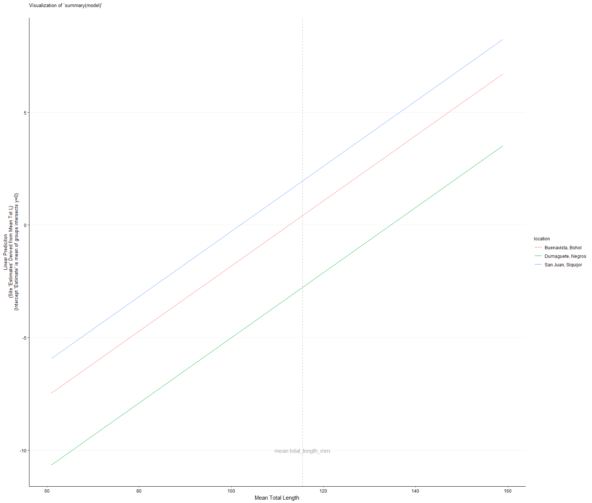
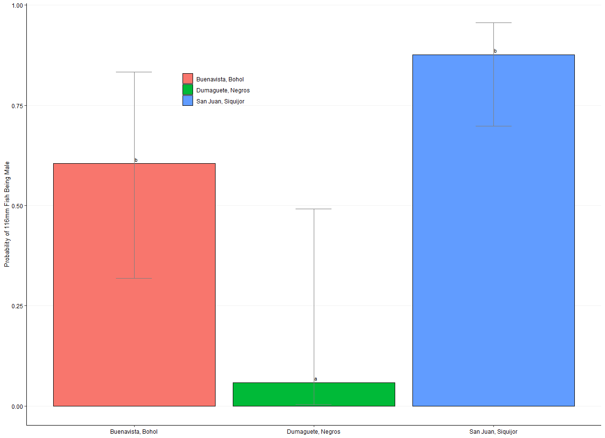
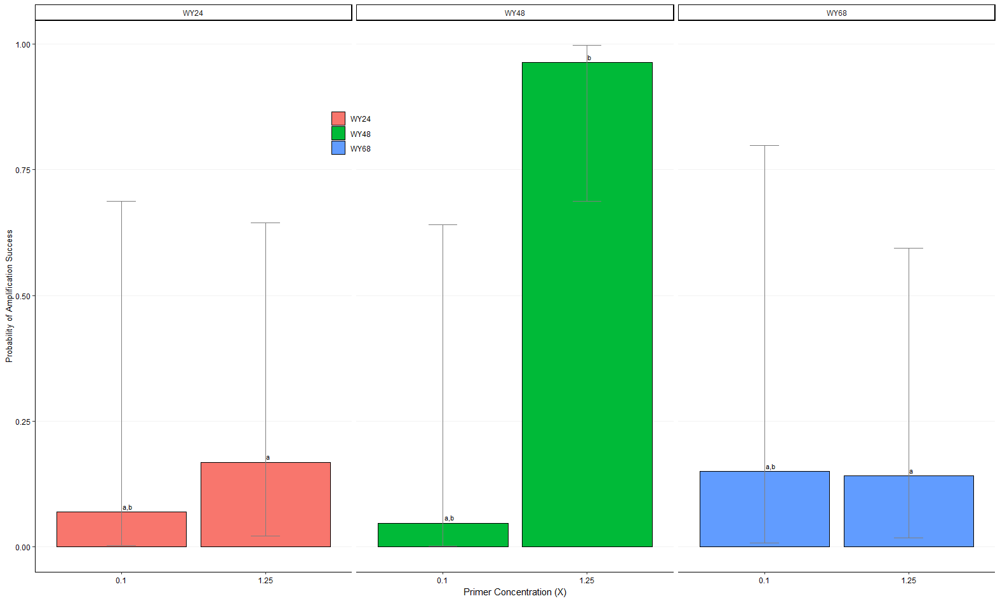

# TESTING HYPOTHESES WITH FIXED and MIXED MODELS

Under construction

---

## [Binomial Fixed Models](fixed_models_binom)

Is there an effect of fishing pressure on the size at which females transition to males in a reef associated fish?  This is an example of running a fixed effects model with `glm`. The data has a binomial response variable, a categorical fixed effect, and a continuous fixed effect.  
| Model Predictions | EMMeans |
| -------------- | -------------- |
| | |

---

## [Binomial Mixed Models](mixed_models_binom)

Is there an effect of primer concentration on the probability of amplification success among loci? This is an example of running a mixed effects model with `glmer`.  The data has a binomial response variable, a categorical fixed effect, a continuous fixed effect, and nested random effects.

---

## [Mixed Models: Count Data](mixed_models_counts)

One MPA, TRNP, has been established for decades.  The other, Cagayancillo, was just established when these data were collected.  Is there a difference in the abundance of large carnivorous fishes in shallow relative to deep mesophotic reefs?  It is hypothesized that deeper fish might have more of a refuge from fishermen, and so we might expect the abundance of shallow fish relative to deep to be less at the newer MPA.  One might also hypothesize that abundance would be greater at the older MPA.

