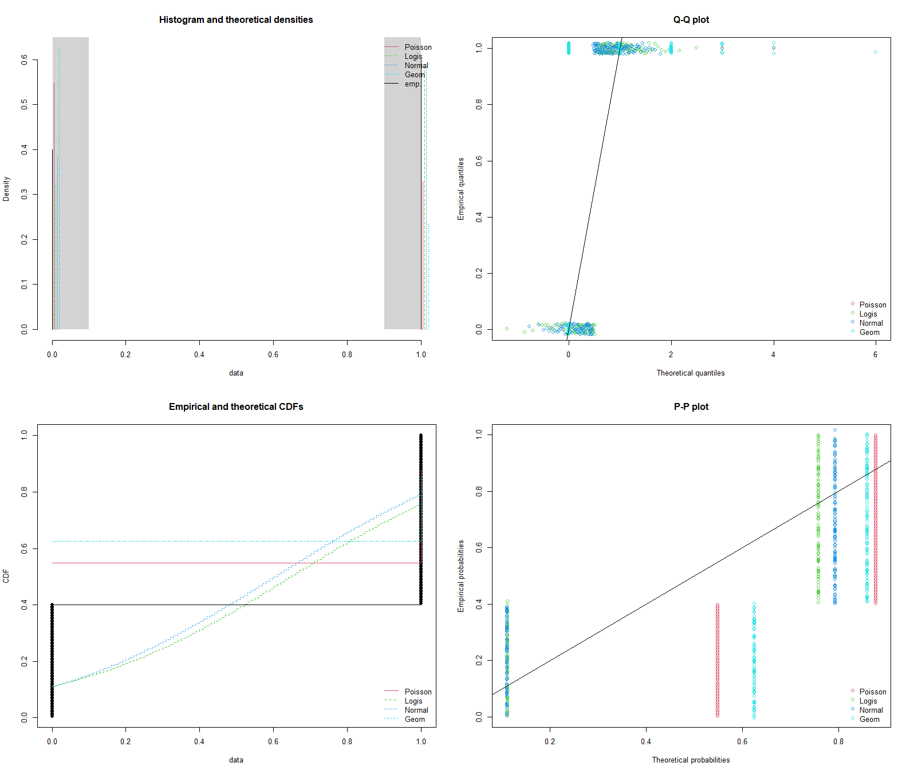
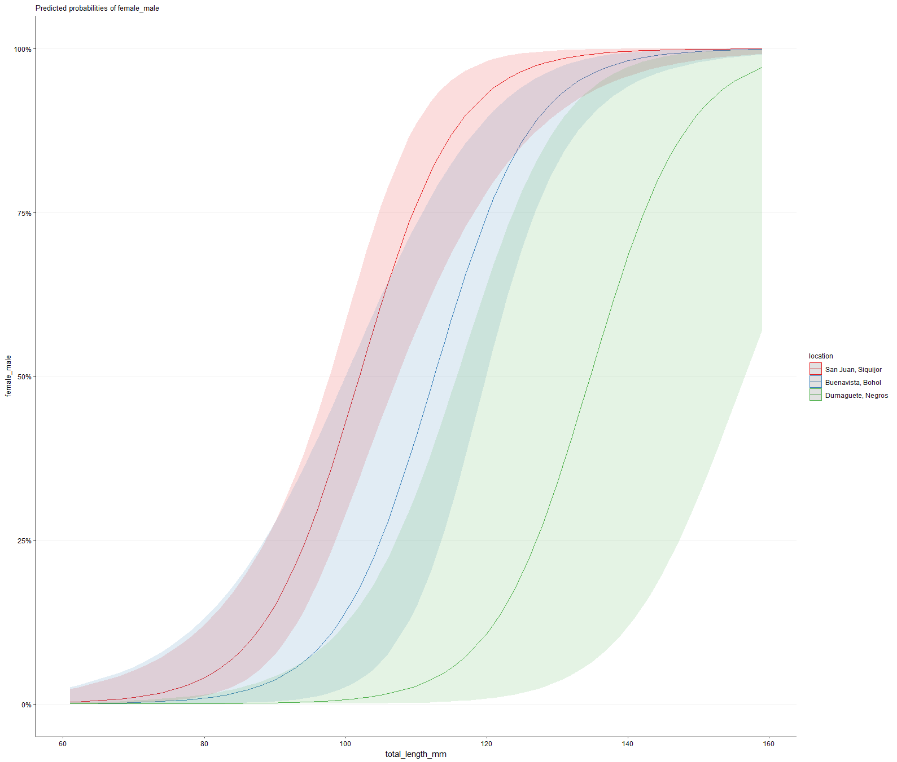

# TESTING HYPOTHESES WITH FIXED MODELS

Is there an effect of fishing pressure on the size at which females transition to males in a reef associated fish? This is an example of running a fixed effects model with glm. The data has a binomial response variable, a categorical fixed effect, and a continuous fixed effect.

---

## Getting Started

Open [`fixed_models_binom.R`](fixed_models_binom.R) in Rstudio and run the `INITIALIZATION` section

NOTE: after loading these packages, you may find that tidyverse commands are affected. The solution is to add the appropriate package name before commands that break code such as `dplyr::select` if `select` doesn't work correctly anymore. This happens when multiple packages have the same command names. The last package loaded takes precidence, and your tidyverse commands break. You could load tidyverse last, but invariably, you will load a package after tidyverse that breaks one of its commands, so it's impossible to avoid this.

We will use Ingrids data set on sex change in _Halichores scapularis_ which has been saved as an R data structure (RDS) file. 

---

## Explore Your Data For the Hypothesis Tests

### basic ggplot plots
It is important to understand the nature of your data. Histograms can help you make decisions on how your data must be treated to conform with the assumptions of statistical models.


Fig 1. Histograms of fish measurements by location and sex.  U=immature, sex cannot be determined, F=female, MF=both sex organs, M=male, PM=primary male, NA= no observation made

Fig 2. Heat maps of sample size (number of libraries) and proportion libraries amplified by well position.


Fig 3. Scatter plot of proportion amplified vs. number of libraries per well address. Numbers of loci are noted with color, and n individuals are noted with shape.


---

### fitdistrplus: An R Package for Fitting Distributions

`vis_dists()` is a function that I made in the FUNCTIONS section of this script.  It accepts the tibble and column name to visualize. Here we evaluate the response variable `female_male`

`vis_dists()` creates three figures


Fig 4. Histogram and cumulative distribution of `ampllification` success


Fig 5. Cullen and Frey Graph of kurtosis vs square of skewness for `ampllification`. **I really like this one.**  This shows you which statistical distribution the data most closely resembles.  Here, the data is falls along the upper boundary of the beta distribution (grey ribbon). Note that the beta distribution describes the greatest amount of parameter space and many other distributions are special cases of the beta. Here, we know that our data binomially distributed because there are only 0 or 1, but the binomial dist is not represented in the Cullen Frey graph. I would expect all binomial data sets to fall along the upper edge of the beta distribution ribbon. 


Fig 6. 4 additional plots that allow you to determine the distribution that most closely fits `ampllification`

---

## Identifying the Distribution Family for you Hypothesis Test

It is especially important to identify the correct statistical distribution for your **response variable**, so the plots above can be used to help with identifying the correct distribution family for that.

Here the rule of thumb is:
* Binomial
	* if your unit of observation falls into one of two categories, such as Male or Female, then your data is binomial
	* percentage and proportion data that can be converted to count data is binomial


---

## Make Visualization of Hypothesis Test

Here we will test for the effect of primer concentration on amplification success among different locations at each locus without subsetting the data.


Fig 7. Plots of amplification success (FALSE=0, TRUE=1) against primer concentration as a function of that recommended in the literature.  Fit lines are logistic.

Some things to notice are that there are not many males from Dumaguete and not many females from Buenavista.  Consequently we might want to test some other hypotheses later. For example, testing for differences in total length by sex and location might be useful. But lets save this for later.

---

## [Fixed Effects Hypthesis Test](https://en.wikipedia.org/wiki/Fixed_effects_model)

If you only have variables that are [fixed](https://en.wikipedia.org/wiki/Fixed_effects_model) then we can use `glm()` to test your hypotheses.

Here we test for differences among locations in the probability that an individual is a male given the total length of the fish. We do not allow the slopes to vary among the sites.  This may be adventageous because sizes sampled differ among the sites and we might expect the slope of the lines to remain similar while the points of inflection vary.

```r
model <<- 
  glm(formula = female_male ~  total_length_mm + location, 
      family = distribution_family,
      data = data)
```

	Call:  glm(formula = female_male ~ total_length_mm + location, family = distribution_family, 
		data = data)

	Coefficients:
				   (Intercept)             total_length_mm   locationDumaguete, Negros  locationSan Juan, Siquijor  
					  -16.2887                      0.1447                     -3.1962                      1.5358  

	Degrees of Freedom: 194 Total (i.e. Null);  191 Residual
	Null Deviance:	    262.5 
	Residual Deviance: 98.76 	AIC: 106.8

What we are really interested in is whether there are significant differences among locations. We can use `summary()` for this. The output shows that Dumaguete is significantly different than the other sites (p = 0.0277) and that the probability of observing males there is lower (estimate = -3.19619).  See [here](https://www.statology.org/interpret-glm-output-in-r/) for additional guidance to interpret this output.

```r
summary(model)
```

	Call:
	glm(formula = female_male ~ total_length_mm + location, family = distribution_family, 
		data = data)

	Deviance Residuals: 
		Min       1Q   Median       3Q      Max  
	-2.0757  -0.2308   0.1258   0.3010   2.3112  

	Coefficients:
								Estimate Std. Error z value Pr(>|z|)    
	(Intercept)                -16.28874    3.64712  -4.466 7.96e-06 ***
	total_length_mm              0.14469    0.02827   5.118 3.09e-07 ***
	locationDumaguete, Negros   -3.19619    1.45193  -2.201   0.0277 *  
	locationSan Juan, Siquijor   1.53578    1.01223   1.517   0.1292    
	---
	Signif. codes:  0 ‘***’ 0.001 ‘**’ 0.01 ‘*’ 0.05 ‘.’ 0.1 ‘ ’ 1

	(Dispersion parameter for binomial family taken to be 1)

		Null deviance: 262.47  on 194  degrees of freedom
	Residual deviance:  98.76  on 191  degrees of freedom
	AIC: 106.76

	Number of Fisher Scoring iterations: 7


Fig 7. Visualization of `model`. Note that the "Estimates"  output by `summary(model)` can be derived from this plot. The site 'Estimates' in `summary(model)` are the y values for each site fit line where x = Mean Tot L. The intercept 'Estimate' is the mean of groups at x=0. Note that the y axis is on the logit scale, not probability of being male.


---

## Estimated Marginal Means and _a priori_ Contrasts

It is nice to have a p-value, and know that Dumaguete has a lower probability of males being observed, but this still leaves something to be desired.  We can dig deeper with the `emmeans` and `contrast` commands.

```r
emmeans_model <<-
  emmeans(model,
          ~ total_length_mm + location,
          alpha = alpha_sig)
```

Again, we can use `summary()` to view the estimated marginal means.  Note that we set `type="response"` so that the units will be in terms of our response variable, the probability of being male (0-1), and thus, having changed sex. The estimated marginal means are returned for the mean length observed in the whole data set, 116 mm. The `prob` column 

```r
# emmeans back transformed to the original units of response var
summary(emmeans_model,      
        type="response")
```

*Table 1.*  Now we are getting somewhere. In this estimated mariginal means table, we see that at 116 mm, the probability that a fish is male from Buenavista is 60.44% (CI95 = 31.9 - 83.3%), whereas the probability is 5.88% (CI95 = 0.4 - 49.2%) in Dumaguete, and is 87.65% (CI95 = 69.8 - 95.6%) in San Juan. 

	total_length_mm location             prob     SE  df asymp.LCL asymp.UCL
				 116 Buenavista, Bohol  0.6044 0.1442 Inf   0.31899     0.833
				 116 Dumaguete, Negros  0.0588 0.0774 Inf   0.00403     0.492
				 116 San Juan, Siquijor 0.8765 0.0619 Inf   0.69818     0.956

	Confidence level used: 0.95 
	Intervals are back-transformed from the logit scale 

Next we run the contrasts to compare sites at the mean total length and determine the probability that the differences observed could be due to random chance (p-values).  The `emmeans` output is good, but we can get more statistically sophisticated with the `contrasts` command, which allows us to explicitly control [False Discovery Rate](https://en.wikipedia.org/wiki/False_discovery_rate) and generate p-values for comparisons of probability of fish being male between locations.  The `emmeans` output is a bit conservative when it comes to FDR.  We use the Benjamini-Hochberg (`bh`) FDR algorithm in `contrasts` but you can select others as required.

```r
contrasts_model_regrid <<- 
  contrast(regrid(emmeans_model), 
           method = 'pairwise', 
           simple = 'each', 
           combine = FALSE, 
           adjust = "bh")
```

*Table 2.* _A priori_ contrasts testing for differences in the probability of 116mm fish being male at the three survey locations. The estimate is the difference in probabilies between sites, where a positive value indicates that the first site in the contrast has a higher probability of fish being male. For example, 116mm fish at Buenavista are 54.6% more likely to be male. Dumaguete fish are significantly less likely to be male at 116mm than fish from the other two sites.

	total_length_mm = 116:
	 contrast                               estimate    SE  df z.ratio p.value
	 Buenavista, Bohol - Dumaguete, Negros     0.546 0.155 Inf   3.520  0.0006
	 Buenavista, Bohol - San Juan, Siquijor   -0.272 0.182 Inf  -1.492  0.1358
	 Dumaguete, Negros - San Juan, Siquijor   -0.818 0.107 Inf  -7.610  <.0001

	P value adjustment: BH method for 3 tests 


---

## Group Sites by Significant Differences with `multicomp::cld`


It is often very convenient to categorize the levels of your categorical variable (location) into groups with significant differences.  One last handy tool is the `multcomp::cld` command, which groups sites together that are not significantly different. You will see in my commented code below that I am skeptical about the emmeans confidence limits calculated by `cld`, but the groupings generally work well.  This is especially true when there are many groups and it becomes difficult to track them all.  The letter based groupings are great to add to figures. 

```r
groupings_model <<-
  multcomp::cld(emmeans_model, 
                alpha = alpha_sig,
                Letters = letters,
                type="response",
                adjust = "bh") %>%
  as.data.frame %>%
  mutate(group = str_remove_all(.group," "),
         group = str_replace_all(group,
                                 "(.)(.)",
                                 "\\1,\\2")) %>%
  rename(response = 3)

groupings_model             # these values are back transformed, groupings based on transformed
```

I noticed that the confidence limits of the emmeans output by `multicomp:cld` do not match those from `emmeans`.  This may cause some slight deviations between confidence limits and groupings.  In other data, the output from `emmeans` matches `afex::afex_plot` and `afex::mixed`, so I think that `emmeans` is more correct where there are conflicts. Here I add the groupings from `cld` to the `emmeans` output for the purposes of making a figure to show the results.

```r
groupings_model_fixed <<-
  summary(emmeans_model,      # emmeans back transformed to the original units of response var
          type="response") %>%
  tibble() %>%
  left_join(groupings_model %>%
              dplyr::select(-response:-asymp.UCL),
            # by = c(str_replace(fixed_vars,
            #                    "[\\+\\*]",
            #                    '" , "'))) %>%
            by = c("total_length_mm",
                   "location")) %>%
  rename(response = 3)

groupings_model_fixed  
```

Table 3. The `multicomp:cld` groupings are added to the emmeans table. Dumaguete is group 'a' and the other sites are both 'b'.

	# A tibble: 3 × 9
	  total_length_mm location           response     SE    df asymp.LCL asymp.UCL .group group
				<dbl> <fct>                 <dbl>  <dbl> <dbl>     <dbl>     <dbl> <chr>  <chr>
	1            116. Buenavista, Bohol    0.604  0.144    Inf   0.319       0.833 "  b"  b    
	2            116. Dumaguete, Negros    0.0588 0.0774   Inf   0.00403     0.492 " a "  a    
	3            116. San Juan, Siquijor   0.877  0.0619   Inf   0.698       0.956 "  b"  b  


Fig 8. Estimated marginal means for the probability that 116mm fish are male at each location.  Letters indicate statistically significant groupings according to `multicomp:cld`.


--

## Visualize Model Predictions (Probability of being Male vs Total Length) with `ggeffects::ggemmeans`

We have tested our hypothesis, but the tables and figures above are not completely satisfying. What about the probability of fish being male at lengths other than the mean?  We would like to show the model output in the same format as Fig 6 above.  Well, we can calculate the estimated marginal means and confidence limits for many values of `total_length_mm` and generate a plot very easily with `ggemmeans`. By setting `terms = "total_length_mm [all]"` many values of total length will be evaluated from the min to the max observed values.

```r
emmeans_ggpredict <- 
  ggemmeans(model,
            terms = c("total_length_mm [all]",
                      "location")) 
  # compatible with ggplot
  # shows models, but extrapolates beyond observations
  plot(emmeans_ggpredict) +
    #this is our custom plot theme defined in USER DEFINED VARIABLES
    theme_myfigs
```


Fig 9. Plots of fish sex (F=0, M=1) against total length.  Fit lines are based on the glm (female_male ~ total_length_mm + location). 

This plot (Fig 9) is pretty good, but it contains extrapolations and does not accurately reflect the data.  We can make this better by filtering the tibble created by `ggemmeans` down to those between the min and max length for each location and adding the original data to the plot using `geom_jitter()`.  In the example below, we use `ggpredict` to bring your attention to its existence, but in this case it is interchangable with `ggemmeans`.

```r
#make a tibble that has the max and min continuous xvar for each categorical xvar
min_max_xvar <-  
data %>%
  rename(x = total_length_mm,
		 group = location) %>%
  group_by(group) %>%
  filter(x == max(x) |
		   x == min(x)) %>%
  dplyr::select(group,
				x) %>%
  arrange(group,
		  x) %>%
  mutate(min_max = case_when(row_number() %% 2 == 0 ~ "max_x",
							 TRUE ~ "min_x")) %>%
  pivot_wider(names_from = min_max,
			  values_from = x)
# then use that tibble to filter the object made by ggpredict and plot
emmeans_ggpredict %>%
left_join(min_max_xvar) %>% 
filter(x >= min_x,
	   x <= max_x) %>% 
plot() +
#add in our observed values of female_male
geom_jitter(data = data,
		   aes(x = total_length_mm,
			   y = female_male,
			   color = location),
		   size = 3,
		   inherit.aes = FALSE,
		   width = 0,
		   height = 0.02) +
theme_myfigs
```


Fig 10. Plots of fish sex (F=0, M=1) against total length.  Fit lines are based on the glm (female_male ~ total_length_mm + location).  The points are the observed data with vertical jittering to better visualize multiple observations of the same length and sex.


This model, without interactions, does not allow the slopes to vary freely among sites, which might be desirable because there are different ranges of sizes at different sites. If we had a good sample of males and females at every site, then we would want to allow the slopes to vary freely. To see the alternative, change the model to `formula = female_male ~ total_length_mm * location`. 

---
