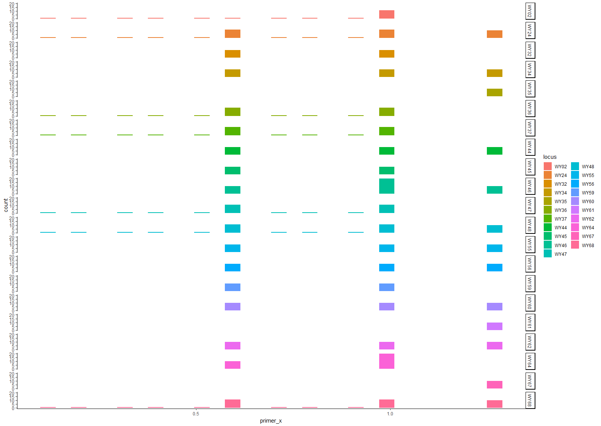
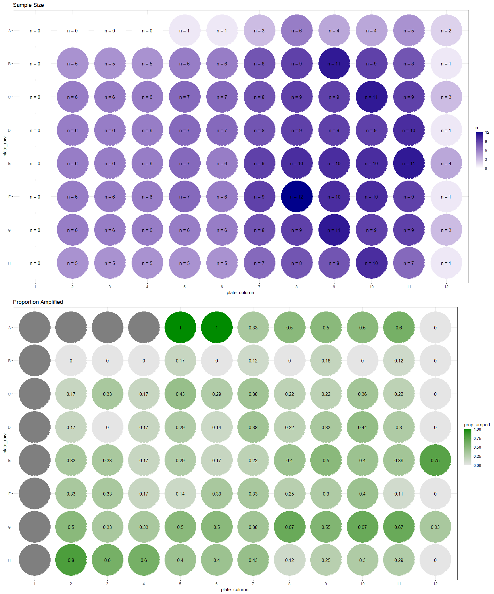
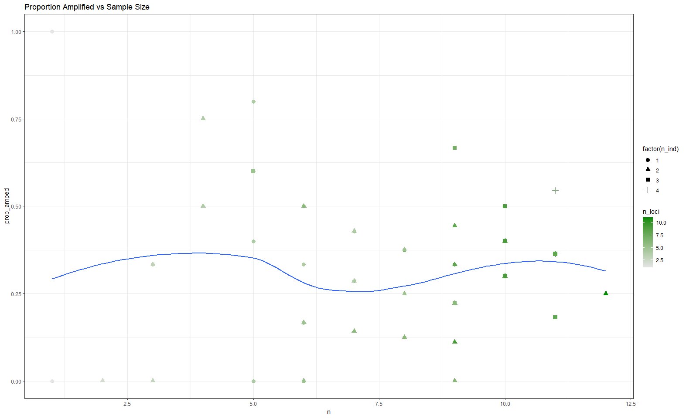
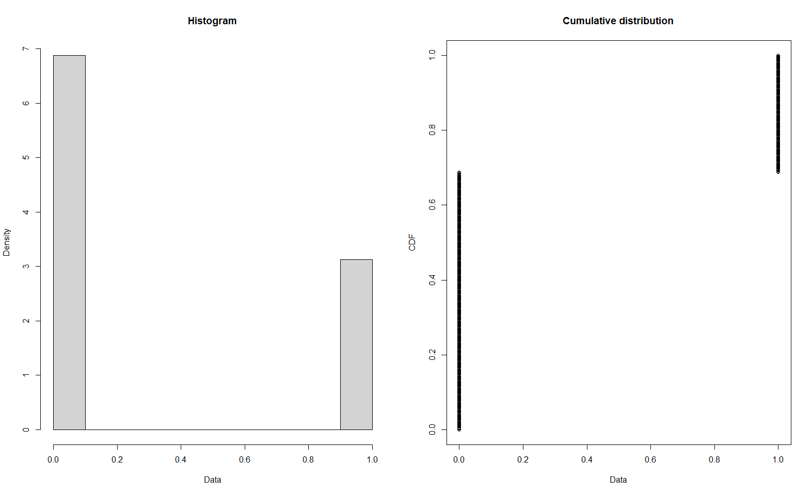
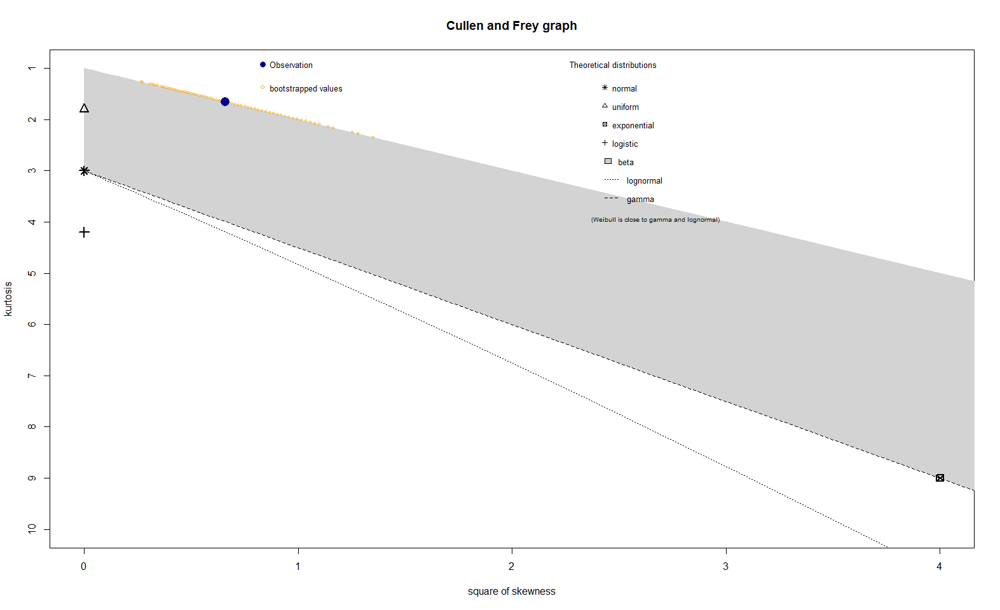
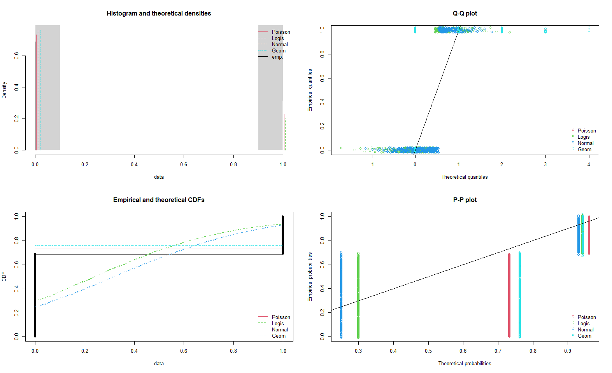
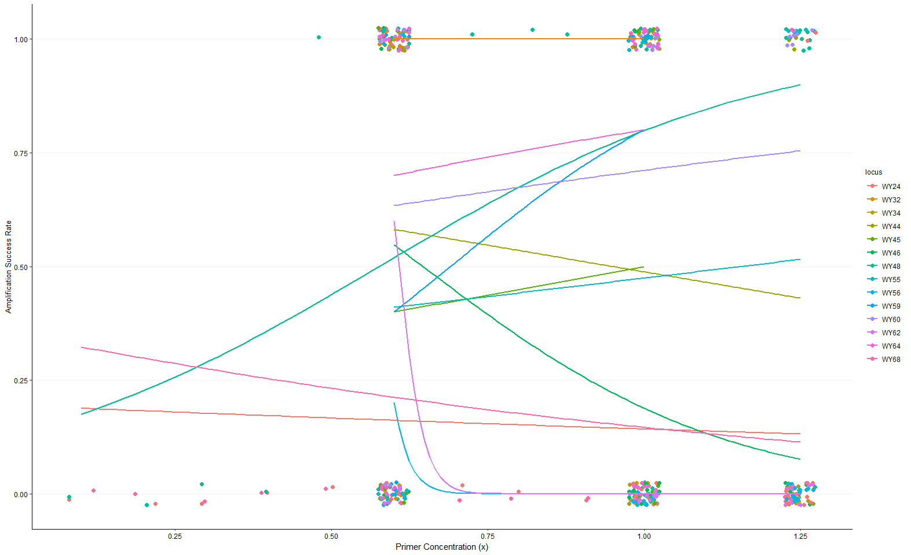

# TESTING HYPOTHESES WITH MIXED MODELS

## Under construction

Is there an effect of primer concentration on the probability of amplification success among loci? This is an example of running a mixed effects model with `glmer`.  The data has a binomial response variable, a categorical fixed effect, a continuous fixed effect, and nested random effects.

---

## Getting Started

Open [`mixed_models_bionom.R`](mixed_models_binom.R) in Rstudio and run the `INITIALIZATION` section

NOTE: after loading these packages, you may find that tidyverse commands are affected. The solution is to add the appropriate package name before commands that break code such as `dplyr::select` if `select` doesn't work correctly anymore. This happens when multiple packages have the same command names. The last package loaded takes precidence, and your tidyverse commands break. You could load tidyverse last, but invariably, you will load a package after tidyverse that breaks one of its commands, so it's impossible to avoid this.

We will use Noelles data set on cross amplification of microsat loci in Visayan spotted deer which has been saved as an R data structure (RDS) file. 

---

## Explore Your Data For the Hypothesis Tests

### basic ggplot plots
It is important to understand the nature of your data. Histograms can help you make decisions on how your data must be treated to conform with the assumptions of statistical models.


Fig 1. Histograms of number of PCR libraries evaluated relative to primer concentration and locus. Note that the data does not represent a complete design and that different loci should probably be subjected to different model tests.

Fig 2. Heatmaps of sample size (number of libraries) and proportion amplified by plate address.



Fig 3. Scatterplot of proportion amplified against number of libraries. Each point is a well address. Shapes represent the number of different individuals and color is the number of loci.

---

### fitdistrplus: An R Package for Fitting Distributions

`vis_dists()` is a function that I made in the FUNCTIONS section of this script.  It accepts the tibble and column name to visualize.

vis_dists() creates three figures


Fig 4. Histogram and cumulative distribution of `amplification`


Fig 5. Cullen and Frey Graph of kurtosis vs square of skewness for `amplification`. **I really like this one.**  This shows you which statistical distribution the data most closely resembles.  Here, the data is nearly log normal, but better fit by the beta distribution.


Fig 6. 4 additional plots that allow you to determine the distribution that most closely fits `amplification`

---

## Identifying the Distribution Family for you Hypothesis Test

It is especially important to identify the correct statistical distribution for your **response variable**, so the plots above can be used to help with identifying the correct distribution family for that.

Here are some rules of thumb:
* Binomial
	* if your unit of observation falls into one of two categories, such as Male or Female, then your data is binomial
	* percentage and proportion data that can be converted to count data is binomial


---

## Make Visualization of Hypothesis Test

Here we will test for the effect of size on the sex of _Halichores scapularis_ among different locations.


Fig 7. Plots of amplification success rate vs. primer concentration. Each point is a PCR library and is jittered by 0.025 both vertically and horizontally.  Fit lines are logistic.

Some things to notice are that some loci are tested across a broader range of primer concentrations than others.  They should probably be split apart into groups and analyzed separately.

---

## [Fixed Effects Hypthesis Test](https://en.wikipedia.org/wiki/Fixed_effects_model)

If you only have variables that are [fixed](https://en.wikipedia.org/wiki/Fixed_effects_model) then we can use `glm()` to test your hypotheses.

Here we test for differences among locations in the probability that an individual is a male given the total length of the fish. We do not allow the slopes to vary among the sites.  This may be adventageous because sizes sampled differ among the sites and we might expect the slope of the lines to remain similar while the points of inflection vary.

```r
model11 <-
  glmer(formula = sampling_design11, 
        family = distribution_family,
        data = data_1bandperloc_11)
```

	Generalized linear mixed model fit by maximum likelihood (Laplace Approximation) ['glmerMod']
	 Family: binomial  ( logit )
	Formula: amplification ~ locus * primer_x + (1 | individual) + (1 | plate_number) +      (1 | plate_row) + (1 | plate_column)
	   Data: data_1bandperloc_11
		 AIC      BIC   logLik deviance df.resid 
	 125.402  153.277  -52.701  105.402      110 
	Random effects:
	 Groups       Name        Std.Dev. 
	 plate_column (Intercept) 0.0004559
	 individual   (Intercept) 0.1769521
	 plate_row    (Intercept) 0.0003342
	 plate_number (Intercept) 1.0106441
	Number of obs: 120, groups:  plate_column, 11; individual, 10; plate_row, 8; plate_number, 5
	Fixed Effects:
		   (Intercept)           locusWY48           locusWY68            primer_x  locusWY48:primer_x  locusWY68:primer_x  
			   -2.6830             -0.8572              0.9542              0.8682              4.5771             -0.9302  

What we are really interested in is whether the primer concentration is affecting amplification success. We can look at a visualization of the model fit to get a better look.

```r
summary(model11)
```

The summary output identifies a potential difference with WY48 (p = 0.0758), which seems to have increasing amplification success with primer concentration.  This is a great example of 0.05 not being a magic number.  It seems very likely that increasing primer concentration will positively affect locus WY48, and there is only a 7.6% probability of it not. 

	Fixed effects:
					   Estimate Std. Error z value Pr(>|z|)  
	(Intercept)         -2.6830     1.9200  -1.397   0.1623  
	locusWY48           -0.8572     2.0448  -0.419   0.6751  
	locusWY68            0.9542     1.7666   0.540   0.5891  
	primer_x             0.8682     2.1161   0.410   0.6816  
	locusWY48:primer_x   4.5771     2.5779   1.776   0.0758 .
	locusWY68:primer_x  -0.9302     2.0406  -0.456   0.6485  
	---
	Signif. codes:  0 ‘***’ 0.001 ‘**’ 0.01 ‘*’ 0.05 ‘.’ 0.1 ‘ ’ 1


Fig 8. Visualization of `model11`. Note that the "Estimates"  output by `summary(model)` can be derived from this plot. The site 'Estimates' in `summary(model)` are the y values for each site fit line where x = mean primer x. The intercept 'Estimate' is the mean of groups at x=0. Note that the y axis is on the logit scale, not probability of amplifcation success, but larger y values are related to increased amplification success..


---

## Estimated Marginal Means and _a priori_ Contrasts

It is nice to have a p-value, and know that Dumaguete has a lower probability of males being observed, but this still leaves something to be desired.  We can dig deeper with the `emmeans` and `contrast` commands.

```r
emmeans_model <<-
  emmeans(model11,
          ~ primer_x + locus,
          alpha = alpha_sig)
```

Again, we can use `summary()` to view the estimated marginal means.  Note that we set `type="response"` so that the units will be in terms of our response variable, the probability of amplifcation success (0-1). The estimated marginal means are returned for the mean primer concentration observed in the whole data set, 0.85x. The `prob` column is the prob of amplifcation success.  The LCL is the lower confidence limit and the UCL is the upper confidence limit of the probability of amplification success.

```r
# emmeans back transformed to the original units of response var
summary(emmeans_model,      
        type="response")
		
summary(emmeans_model_min_max,      
        type="response")
```

*Table 1.*  Now we are getting somewhere. In this estimated mariginal means table, we see that at primer concentration 0.85x, the probability of amplification for WY48 is 74.8% (CI95 = 44.18 - 91.8%), but it is lower for the other loci. At a primer concentration of 1.25x, the predicted amplification success rate of WY48 goes up to 96.33% (CI95 = 68.724 - 99.7%).

	 primer_x locus  prob     SE  df asymp.LCL asymp.UCL
		 0.85 WY24  0.125 0.0779 Inf    0.0342     0.366
		 0.85 WY48  0.748 0.1271 Inf    0.4418     0.918
		 0.85 WY68  0.144 0.0866 Inf    0.0408     0.400
	
	Confidence level used: 0.95 
	Intervals are back-transformed from the logit scale

	 primer_x locus   prob     SE  df asymp.LCL asymp.UCL
		 0.10 WY24  0.0694 0.1114 Inf   0.00253     0.687
		 1.25 WY24  0.1683 0.1564 Inf   0.02215     0.644
		 0.10 WY48  0.0476 0.0827 Inf   0.00140     0.641
		 1.25 WY48  0.9633 0.0448 Inf   0.68724     0.997
		 0.10 WY68  0.1500 0.2023 Inf   0.00781     0.798
		 1.25 WY68  0.1411 0.1353 Inf   0.01808     0.594

	Confidence level used: 0.95 
	Intervals are back-transformed from the logit scale 

Next we run the contrasts to compare sites at the maximum primer concentration and determine the probability that the differences observed could be due to random chance (p-values).  The `emmeans` output is good, but we can get more statistically sophisticated with the `contrasts` command, which allows us to explicitly control [False Discovery Rate](https://en.wikipedia.org/wiki/False_discovery_rate) and generate p-values for comparisons of probability of amplification between loci.  The `emmeans` output is a bit conservative when it comes to FDR.  We use the Benjamini-Hochberg (`bh`) FDR algorithm in `contrasts` but you can select others as required.

```r
contrasts_model_regrid <<- 
  contrast(regrid(emmeans_model_min_max), 
           method = 'pairwise', 
           simple = 'each', 
           combine = FALSE, 
           adjust = "bh")
```

*Table 2.* _A priori_ contrasts testing for differences in the probability of amplification between 0.1x and 1.25x primer concentration, as well as between loci at each of these primer concentrations. The estimate is the difference in probabilies between loci or primer concentrations, where a negative value indicates that the second category in the contrast has a higher probability of amplification. For example, locus WY48 is 91.564% more likely to amplify at 1.25x than 0.1x (p < 0.0001). WY48 is also 79.5% more likely to amplify than WY24 at 1.25x (p  < 0.0001).

	locus = WY24:
	 contrast                   estimate    SE  df z.ratio p.value
	 primer_x0.1 - primer_x1.25 -0.09891 0.228 Inf  -0.433  0.6651

	locus = WY48:
	 contrast                   estimate    SE  df z.ratio p.value
	 primer_x0.1 - primer_x1.25 -0.91564 0.115 Inf  -7.945  <.0001

	locus = WY68:
	 contrast                   estimate    SE  df z.ratio p.value
	 primer_x0.1 - primer_x1.25  0.00886 0.287 Inf   0.031  0.9754


	$`simple contrasts for locus`
	primer_x = 0.10:
	 contrast    estimate    SE  df z.ratio p.value
	 WY24 - WY48   0.0218 0.102 Inf   0.214  0.8305
	 WY24 - WY68  -0.0806 0.169 Inf  -0.476  0.8305
	 WY48 - WY68  -0.1023 0.176 Inf  -0.582  0.8305

	primer_x = 1.25:
	 contrast    estimate    SE  df z.ratio p.value
	 WY24 - WY48  -0.7950 0.152 Inf  -5.225  <.0001
	 WY24 - WY68   0.0272 0.147 Inf   0.185  0.8529
	 WY48 - WY68   0.8222 0.132 Inf   6.217  <.0001

	P value adjustment: BH method for 3 tests  


---

## Group Sites by Significant Differences with `multicomp::cld`


It is often very convenient to categorize the levels of your categorical variable (location) into groups with significant differences.  One last handy tool is the `multcomp::cld` command, which groups sites together that are not significantly different. You will see in my commented code below that I am skeptical about the emmeans confidence limits calculated by `cld`, but the groupings generally work well.  This is especially true when there are many groups and it becomes difficult to track them all.  The letter based groupings are great to add to figures. 

```r
groupings_model <<-
  multcomp::cld(emmeans_model, 
                alpha = alpha_sig,
                Letters = letters,
                type="response",
                adjust = "bh") %>%
  as.data.frame %>%
  mutate(group = str_remove_all(.group," "),
         group = str_replace_all(group,
                                 "(.)(.)",
                                 "\\1,\\2")) %>%
  rename(response = 3)

groupings_model             # these values are back transformed, groupings based on transformed
```

I noticed that the confidence limits of the emmeans output by `multicomp:cld` do not match those from `emmeans`.  This may cause some slight deviations between confidence limits and groupings.  In other data, the output from `emmeans` matches `afex::afex_plot` and `afex::mixed`, so I think that `emmeans` is more correct where there are conflicts. Here I add the groupings from `cld` to the `emmeans` output for the purposes of making a figure to show the results.

```r
groupings_model_fixed <<-
  summary(emmeans_model,      # emmeans back transformed to the original units of response var
          type="response") %>%
  tibble() %>%
  left_join(groupings_model %>%
              dplyr::select(-response:-asymp.UCL),
            # by = c(str_replace(fixed_vars,
            #                    "[\\+\\*]",
            #                    '" , "'))) %>%
            by = c("total_length_mm",
                   "location")) %>%
  rename(response = 3)

groupings_model_fixed  
```

Table 3. The `multicomp:cld` groupings are added to the emmeans table. Dumaguete is group 'a' and the other sites are both 'b'.

	# A tibble: 3 × 9
	  total_length_mm location           response     SE    df asymp.LCL asymp.UCL .group group
				<dbl> <fct>                 <dbl>  <dbl> <dbl>     <dbl>     <dbl> <chr>  <chr>
	1            116. Buenavista, Bohol    0.604  0.144    Inf   0.319       0.833 "  b"  b    
	2            116. Dumaguete, Negros    0.0588 0.0774   Inf   0.00403     0.492 " a "  a    
	3            116. San Juan, Siquijor   0.877  0.0619   Inf   0.698       0.956 "  b"  b  


Fig 8. Estimated marginal means for the probability that 116mm fish are male at each location.  Letters indicate statistically significant groupings according to `multicomp:cld`.


--

## Visualize Model Predictions (Probability of being Male vs Total Length) with `ggeffects::ggemmeans`

We have tested our hypothesis, but the tables and figures above are not completely satisfying. What about the probability of fish being male at lengths other than the mean?  We would like to show the model output in the same format as Fig 6 above.  Well, we can calculate the estimated marginal means and confidence limits for many values of `total_length_mm` and generate a plot very easily with `ggemmeans`. By setting `terms = "total_length_mm [all]"` many values of total length will be evaluated from the min to the max observed values.

```r
emmeans_ggpredict <- 
  ggemmeans(model,
            terms = c("total_length_mm [all]",
                      "location")) 
  # compatible with ggplot
  # shows models, but extrapolates beyond observations
  plot(emmeans_ggpredict) +
    #this is our custom plot theme defined in USER DEFINED VARIABLES
    theme_myfigs
```


Fig 9. Plots of fish sex (F=0, M=1) against total length.  Fit lines are based on the glm (female_male ~ total_length_mm + location). 

This plot (Fig 9) is pretty good, but it contains extrapolations and does not accurately reflect the data.  We can make this better by filtering the tibble created by `ggemmeans` down to those between the min and max length for each location and adding the original data to the plot using `geom_jitter()`.  In the example below, we use `ggpredict` to bring your attention to its existence, but in this case it is interchangable with `ggemmeans`.

```r
#make a tibble that has the max and min continuous xvar for each categorical xvar
min_max_xvar <-  
data %>%
  rename(x = total_length_mm,
		 group = location) %>%
  group_by(group) %>%
  filter(x == max(x) |
		   x == min(x)) %>%
  dplyr::select(group,
				x) %>%
  arrange(group,
		  x) %>%
  mutate(min_max = case_when(row_number() %% 2 == 0 ~ "max_x",
							 TRUE ~ "min_x")) %>%
  pivot_wider(names_from = min_max,
			  values_from = x)
# then use that tibble to filter the object made by ggpredict and plot
emmeans_ggpredict %>%
left_join(min_max_xvar) %>% 
filter(x >= min_x,
	   x <= max_x) %>% 
plot() +
#add in our observed values of female_male
geom_jitter(data = data,
		   aes(x = total_length_mm,
			   y = female_male,
			   color = location),
		   size = 3,
		   inherit.aes = FALSE,
		   width = 0,
		   height = 0.02) +
theme_myfigs
```


Fig 10. Plots of fish sex (F=0, M=1) against total length.  Fit lines are based on the glm (female_male ~ total_length_mm + location).  The points are the observed data with vertical jittering to better visualize multiple observations of the same length and sex.


This model, without interactions, does not allow the slopes to vary freely among sites, which might be desirable because there are different ranges of sizes at different sites. If we had a good sample of males and females at every site, then we would want to allow the slopes to vary freely. To see the alternative, change the model to `formula = female_male ~ total_length_mm * location`. 

---


## Enter Information About Your Data for A Hypothesis Test

I tried to make it easier to get the correct statistical model by breaking it down to the different components
	* response var
		* binomial response vars
	* [fixed effect vars](https://www.stat.purdue.edu/~ghobbs/STAT_512/Lecture_Notes/ANOVA/Topic_34.pdf)
	* [random effect vars](https://www.stat.purdue.edu/~ghobbs/STAT_512/Lecture_Notes/ANOVA/Topic_34.pdf)

Consult the R script

---

## Fitting Statistical Model w [afex::mixed](https://www.rdocumentation.org/packages/afex/versions/1.1-1/topics/mixed)

[afex package on github](https://github.com/singmann/afex)

[afex help forum](https://afex.singmann.science/)


