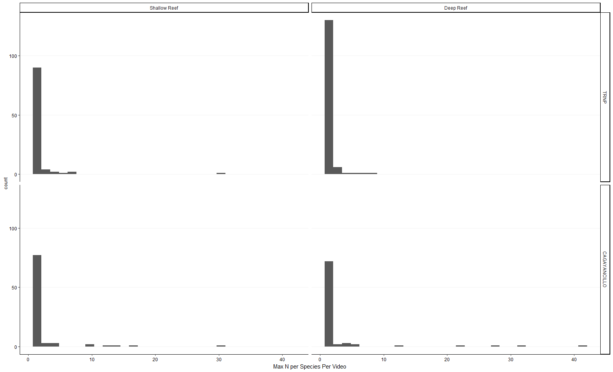
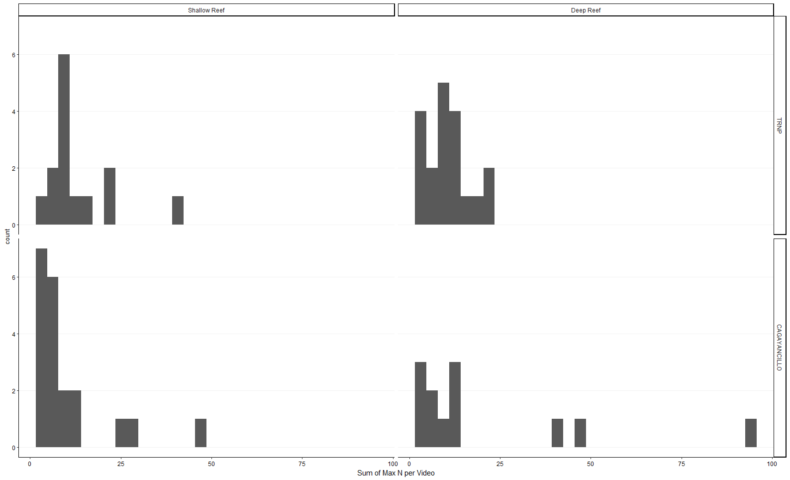
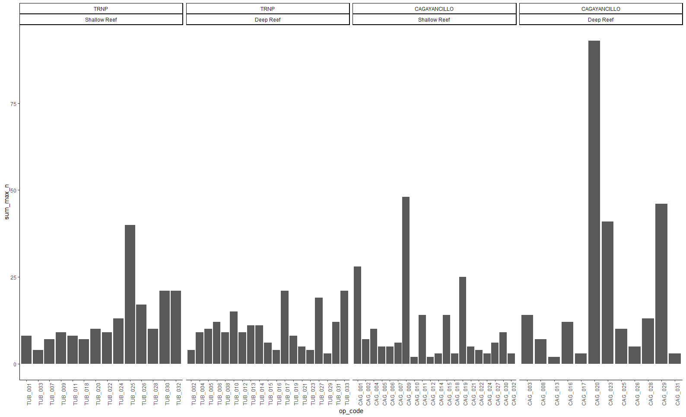
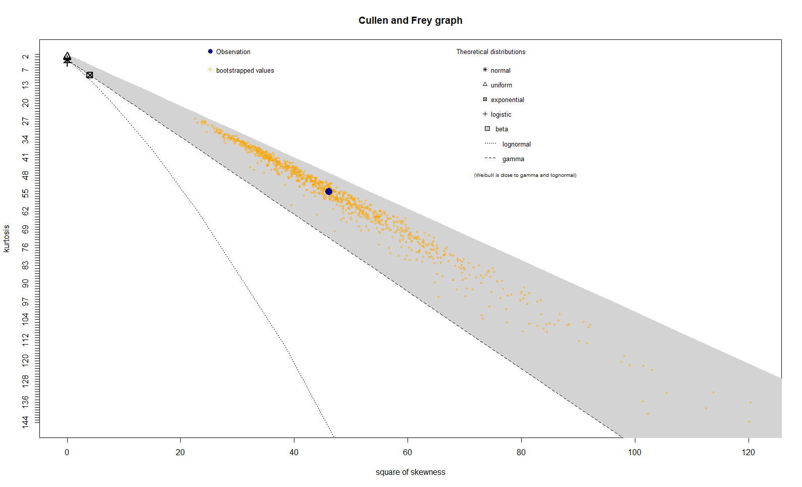
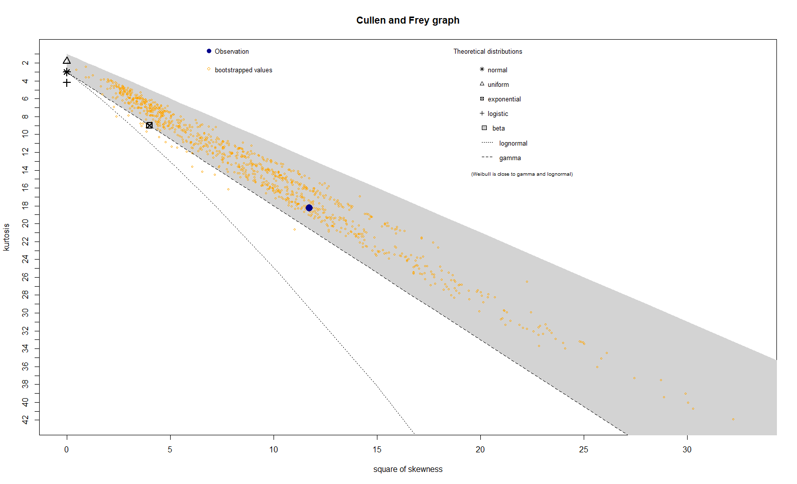
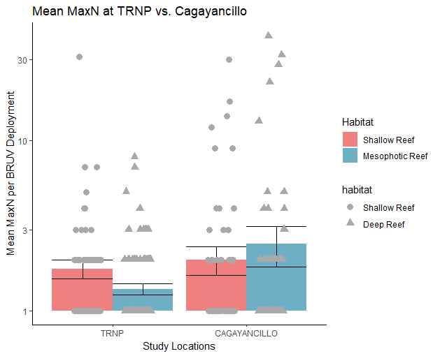
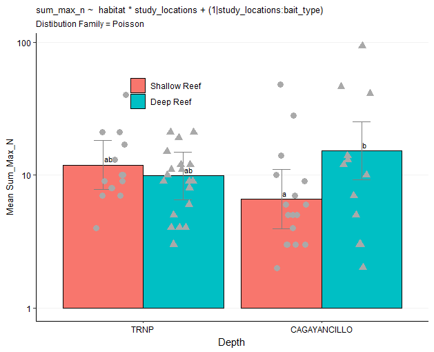

# TESTING HYPOTHESES WITH MIXED & FIXED MODELS: COUNT DATA

One MPA, TRNP, has been established for decades.  The other, Cagayancillo, was just established when these data were collected.  Is there a difference in the abundance of large carnivorous fishes in shallow relative to deep mesophotic reefs.  It is hypothesized that deeper fish might have more of a refuge from fishermen, and so we might expect the abundance of shallow fish relative to deep to be less at the newer MPA.  One might also hypothesize that abundance would be greater at the older MPA.

Baited videos were scored for the most indiviudals from each species that were visible in one frame - the max n.  Different stations received different bait fish, a confounding factor. 

---

## Getting Started

Open [`mixed_models_bionom.R`](mixed_models_binom.R) in Rstudio and run the `INITIALIZATION` section

NOTE: after loading these packages, you may find that tidyverse commands are affected. The solution is to add the appropriate package name before commands that break code such as `dplyr::select` if `select` doesn't work correctly anymore. This happens when multiple packages have the same command names. The last package loaded takes precidence, and your tidyverse commands break. You could load tidyverse last, but invariably, you will load a package after tidyverse that breaks one of its commands, so it's impossible to avoid this.

We will use Noelles data set on cross amplification of microsat loci in Visayan spotted deer which has been saved as an R data structure (RDS) file. 

---

## Explore Your Data For the Hypothesis Tests

### basic ggplot plots
It is important to understand the nature of your data. Histograms can help you make decisions on how your data must be treated to conform with the assumptions of statistical models.


Fig 1. Histograms of the maximum number of fish from the same species  per video visible within one frame by MPA and depth.  


Fig 2. Histograms of the sum of maximum number of fish from the same species per video visible within one frame by MPA and depth.



Fig 3. Barplot showing the sum of maximum number of fish from the same species per video visible within one frame.

---

### fitdistrplus: An R Package for Fitting Distributions

`vis_dists()` is a function that I made in the FUNCTIONS section of this script.  It accepts the tibble and column name to visualize.

Let us look at the statistical distribution for both the `max_n` values and the `sum_max_n` values.  The difference here is that `sum_max_n` are the `max_n` values summed within a video.


Fig 4. Cullen and Frey Graph of kurtosis vs square of skewness for `max_n`. This shows you which statistical distribution the data most closely resembles.  Here, the data is best fit by the beta distribution.


Fig 5. Cullen and Frey Graph of kurtosis vs square of skewness for `max_n`. This shows you which statistical distribution the data most closely resembles.  Here, the data is best fit by the beta distribution but the bootstraps are much messier. 


---

## Identifying the Distribution Family for you Hypothesis Test

It is especially important to identify the correct statistical distribution for your **response variable**, so the plots above can be used to help with identifying the correct distribution family for that. But realize that it's the distribution of the errors in the mdoel that matter. 

Here are some rules of thumb:
* Binomial
	* if your unit of observation falls into one of two categories, such as Male or Female, then your data is binomial
	* percentage and proportion data that can be converted to count data is binomial
* Poisson
	* if your resposne variable is counts, this is a good place to start
* Gamma
	* if your response variable is continuous and is not pct or bounded by zero and one, this is a good place to start


---

## Make Visualization of Hypothesis Test

Here we will test for the effect of MPA and depth on the mean `mean_max_n`.


Fig 6. Plots of mean_mean_max_n by MPA and depth category.  Error bars are standard error.

---

## [Generalized Linear Mixed Effects Hypothesis Test](https://en.wikipedia.org/wiki/Generalized_linear_mixed_model)

If you only have variables that are [fixed](https://en.wikipedia.org/wiki/Fixed_effects_model) then we can use `glm()` to test your hypotheses.

Here we test for differences among locations in the probability that an individual is a male given the total length of the fish. We do not allow the slopes to vary among the sites.  This may be adventageous because sizes sampled differ among the sites and we might expect the slope of the lines to remain similar while the points of inflection vary.

```r
model11 <-
  glmer(formula = sampling_design11, 
        family = distribution_family,
        data = data_1bandperloc_11)
```

	Generalized linear mixed model fit by maximum likelihood (Laplace Approximation) ['glmerMod']
	 Family: binomial  ( logit )
	Formula: amplification ~ locus * primer_x + (1 | individual) + (1 | plate_number) +      (1 | plate_row) + (1 | plate_column)
	   Data: data_1bandperloc_11
		 AIC      BIC   logLik deviance df.resid 
	 125.402  153.277  -52.701  105.402      110 
	Random effects:
	 Groups       Name        Std.Dev. 
	 plate_column (Intercept) 0.0004559
	 individual   (Intercept) 0.1769521
	 plate_row    (Intercept) 0.0003342
	 plate_number (Intercept) 1.0106441
	Number of obs: 120, groups:  plate_column, 11; individual, 10; plate_row, 8; plate_number, 5
	Fixed Effects:
		   (Intercept)           locusWY48           locusWY68            primer_x  locusWY48:primer_x  locusWY68:primer_x  
			   -2.6830             -0.8572              0.9542              0.8682              4.5771             -0.9302  

What we are really interested in is whether the primer concentration is affecting amplification success. We can look at a visualization of the model fit to get a better look.

```r
summary(model11)
```

The summary output identifies a potential difference with WY48 (p = 0.0758), which seems to have increasing amplification success with primer concentration.  This is a great example of 0.05 not being a magic number.  It seems very likely that increasing primer concentration will positively affect locus WY48, and there is only a 7.6% probability of it not. 

	Fixed effects:
					   Estimate Std. Error z value Pr(>|z|)  
	(Intercept)         -2.6830     1.9200  -1.397   0.1623  
	locusWY48           -0.8572     2.0448  -0.419   0.6751  
	locusWY68            0.9542     1.7666   0.540   0.5891  
	primer_x             0.8682     2.1161   0.410   0.6816  
	locusWY48:primer_x   4.5771     2.5779   1.776   0.0758 .
	locusWY68:primer_x  -0.9302     2.0406  -0.456   0.6485  
	---
	Signif. codes:  0 ‘***’ 0.001 ‘**’ 0.01 ‘*’ 0.05 ‘.’ 0.1 ‘ ’ 1


Fig 8. Visualization of `model11`. Note that the "Estimates"  output by `summary(model)` can be derived from this plot. The site 'Estimates' in `summary(model)` are the y values for each site fit line where x = mean primer x. The intercept 'Estimate' is the mean of groups at x=0. Note that the y axis is on the logit scale, not probability of amplifcation success, but larger y values are related to increased amplification success..


---

## Estimated Marginal Means and _a priori_ Contrasts

It is nice to have a p-value, and know that Dumaguete has a lower probability of males being observed, but this still leaves something to be desired.  We can dig deeper with the `emmeans` and `contrast` commands.

```r
emmeans_model <<-
  emmeans(model11,
          ~ primer_x + locus,
          alpha = alpha_sig)

emmeans_model_min_max <<-
  emmeans(model11,
        ~ primer_x + locus,
        alpha = alpha_sig,
        cov.reduce = range)
```

Again, we can use `summary()` to view the estimated marginal means.  Note that we set `type="response"` so that the units will be in terms of our response variable, the probability of amplifcation success (0-1). The estimated marginal means are returned for the mean primer concentration observed in the whole data set, 0.85x. The `prob` column is the prob of amplifcation success.  The LCL is the lower confidence limit and the UCL is the upper confidence limit of the probability of amplification success.

```r
# emmeans back transformed to the original units of response var
summary(emmeans_model,      
        type="response")
		
summary(emmeans_model_min_max,      
        type="response")
```

*Table 1.*  Now we are getting somewhere. In this estimated mariginal means table, we see that at primer concentration 0.85x, the probability of amplification for WY48 is 74.8% (CI95 = 44.18 - 91.8%), but it is lower for the other loci. At a primer concentration of 1.25x, the predicted amplification success rate of WY48 goes up to 96.33% (CI95 = 68.724 - 99.7%).

	 primer_x locus  prob     SE  df asymp.LCL asymp.UCL
		 0.85 WY24  0.125 0.0779 Inf    0.0342     0.366
		 0.85 WY48  0.748 0.1271 Inf    0.4418     0.918
		 0.85 WY68  0.144 0.0866 Inf    0.0408     0.400
	
	Confidence level used: 0.95 
	Intervals are back-transformed from the logit scale

	 primer_x locus   prob     SE  df asymp.LCL asymp.UCL
		 0.10 WY24  0.0694 0.1114 Inf   0.00253     0.687
		 1.25 WY24  0.1683 0.1564 Inf   0.02215     0.644
		 0.10 WY48  0.0476 0.0827 Inf   0.00140     0.641
		 1.25 WY48  0.9633 0.0448 Inf   0.68724     0.997
		 0.10 WY68  0.1500 0.2023 Inf   0.00781     0.798
		 1.25 WY68  0.1411 0.1353 Inf   0.01808     0.594

	Confidence level used: 0.95 
	Intervals are back-transformed from the logit scale 

Next we run the contrasts to compare sites at the maximum primer concentration and determine the probability that the differences observed could be due to random chance (p-values).  The `emmeans` output is good, but we can get more statistically sophisticated with the `contrasts` command, which allows us to explicitly control [False Discovery Rate](https://en.wikipedia.org/wiki/False_discovery_rate) and generate p-values for comparisons of probability of amplification between loci.  The `emmeans` output is a bit conservative when it comes to FDR.  We use the Benjamini-Hochberg (`bh`) FDR algorithm in `contrasts` but you can select others as required.

```r
contrasts_model_regrid <<- 
  contrast(regrid(emmeans_model_min_max), 
           method = 'pairwise', 
           simple = 'each', 
           combine = FALSE, 
           adjust = "bh")
```

*Table 2.* _A priori_ contrasts testing for differences in the probability of amplification between 0.1x and 1.25x primer concentration, as well as between loci at each of these primer concentrations. The estimate is the difference in probabilies between loci or primer concentrations, where a negative value indicates that the second category in the contrast has a higher probability of amplification. For example, locus WY48 is 91.564% more likely to amplify at 1.25x than 0.1x (p < 0.0001). WY48 is also 79.5% more likely to amplify than WY24 at 1.25x (p  < 0.0001).

	locus = WY24:
	 contrast                   estimate    SE  df z.ratio p.value
	 primer_x0.1 - primer_x1.25 -0.09891 0.228 Inf  -0.433  0.6651

	locus = WY48:
	 contrast                   estimate    SE  df z.ratio p.value
	 primer_x0.1 - primer_x1.25 -0.91564 0.115 Inf  -7.945  <.0001

	locus = WY68:
	 contrast                   estimate    SE  df z.ratio p.value
	 primer_x0.1 - primer_x1.25  0.00886 0.287 Inf   0.031  0.9754


	$`simple contrasts for locus`
	primer_x = 0.10:
	 contrast    estimate    SE  df z.ratio p.value
	 WY24 - WY48   0.0218 0.102 Inf   0.214  0.8305
	 WY24 - WY68  -0.0806 0.169 Inf  -0.476  0.8305
	 WY48 - WY68  -0.1023 0.176 Inf  -0.582  0.8305

	primer_x = 1.25:
	 contrast    estimate    SE  df z.ratio p.value
	 WY24 - WY48  -0.7950 0.152 Inf  -5.225  <.0001
	 WY24 - WY68   0.0272 0.147 Inf   0.185  0.8529
	 WY48 - WY68   0.8222 0.132 Inf   6.217  <.0001

	P value adjustment: BH method for 3 tests  


---

## Group Sites by Significant Differences with `multicomp::cld`


It is often very convenient to categorize the levels of your categorical variable (location) into groups with significant differences.  One last handy tool is the `multcomp::cld` command, which groups sites together that are not significantly different. You will see in my commented code below that I am skeptical about the emmeans confidence limits calculated by `cld`, but the groupings generally work well.  This is especially true when there are many groups and it becomes difficult to track them all.  The letter based groupings are great to add to figures. 

```r
groupings_model <<-
  multcomp::cld(emmeans_model_min_max, 
                alpha = alpha_sig,
                Letters = letters,
                type="response",
                adjust = "bh") %>%
  as.data.frame %>%
  mutate(group = str_remove_all(.group," "),
         group = str_replace_all(group,
                                 "(.)(.)",
                                 "\\1,\\2")) %>%
  rename(response = 3)

groupings_model             # these values are back transformed, groupings based on transformed
```

I noticed that the confidence limits of the emmeans output by `multicomp:cld` do not match those from `emmeans`.  This may cause some slight deviations between confidence limits and groupings.  In other data, the output from `emmeans` matches `afex::afex_plot` and `afex::mixed`, so I think that `emmeans` is more correct where there are conflicts. Here I add the groupings from `cld` to the `emmeans` output for the purposes of making a figure to show the results.

```r
groupings_model_fixed <<-
  summary(emmeans_model_min_max,      # emmeans back transformed to the original units of response var
          type="response") %>%
  tibble() %>%
  left_join(groupings_model %>%
              dplyr::select(-response:-asymp.UCL),
            # by = c(str_replace(fixed_vars,
            #                    "[\\+\\*]",
            #                    '" , "'))) %>%
            by = c("primer_x",
                   "locus")) %>%
  rename(response = 3)

groupings_model_fixed  
```

Table 3. The `multicomp:cld` groupings are added to the emmeans table. Only two groups are identified 'a' and 'b'. 

  primer_x locus response     SE    df asymp.LCL asymp.UCL .group group
     <dbl> <fct>    <dbl>  <dbl> <dbl>     <dbl>     <dbl> <chr>  <chr>
1     0.1  WY24    0.0694 0.111    Inf   0.00253     0.687 " ab"  a,b  
2     1.25 WY24    0.168  0.156    Inf   0.0221      0.644 " a "  a    
3     0.1  WY48    0.0476 0.0827   Inf   0.00140     0.641 " ab"  a,b  
4     1.25 WY48    0.963  0.0448   Inf   0.687       0.997 "  b"  b    
5     0.1  WY68    0.150  0.202    Inf   0.00781     0.798 " ab"  a,b  
6     1.25 WY68    0.141  0.135    Inf   0.0181      0.594 " a "  a    

Fig 9. Estimated marginal means for the probability that 116mm fish are male at each location.  Letters indicate statistically significant groupings according to `multicomp:cld`. Note that the groups conflict with the contrasts.  This can happen at the edge of significance (0.05 in this case).


--

## Visualize Model Predictions (Probability of Amplificaiton vs Primer Concentration) with `ggeffects::ggemmeans`

We have tested our hypothesis, but the tables and figures above are not completely satisfying. What about the probability of fish being male at lengths other than the mean?  We would like to show the model output in the same format as Fig 7 above.  Well, we can calculate the estimated marginal means and confidence limits for many values of `amplification` and generate a plot very easily with `ggemmeans`. By setting `terms = "amplification [all]"` many values of total length will be evaluated from the min to the max observed values.

```r
emmeans_ggpredict <- 
  ggemmeans(model11,
            terms = c("primer_x [all]",
                      "locus")) 
# compatible with ggplot
# shows models, but might extrapolate beyond observations
plot(emmeans_ggpredict) +
  #this is our custom plot theme defined in USER DEFINED VARIABLES
  theme_myfigs
```


Fig 10. Plots of amplification success against primer concentration.  Fit lines are based on the glmer (amplification ~  locus * primer_x + (1|individual) + (1|plate_number) + (1|plate_row) + (1|plate_column)). 

This plot (Fig 9) is pretty good, but it might contain extrapolations and does not have the data.  We can make this better by filtering the tibble created by `ggemmeans` down to those between the min and max length for each location and adding the original data to the plot using `geom_jitter()`.  In the example below, we use `ggpredict` to bring your attention to its existence, but in this case it is interchangable with `ggemmeans`.

```r
#make a tibble that has the max and min continuous xvar for each categorical xvar
min_max_xvar <-  
  data_1bandperloc_11 %>%
  rename(x = primer_x,
         group = locus) %>%
  group_by(group) %>%
  filter(x == max(x) |
           x == min(x)) %>%
  dplyr::select(group,
                x) %>%
  arrange(group,
          x) %>%
  distinct() %>%
  mutate(min_max = case_when(row_number() %% 2 == 0 ~ "max_x",
                             TRUE ~ "min_x")) %>%
  pivot_wider(names_from = min_max,
              values_from = x)
# then use that tibble to filter the object made by ggpredict and plot
emmeans_ggpredict %>%
  left_join(min_max_xvar) %>% 
  filter(x >= min_x,
         x <= max_x) %>% 
  plot() +
  #add in our observed values of female_male
  geom_jitter(data = data_1bandperloc_11,
              aes(x = primer_x,
                  y = amplification,
                  color = locus),
              size = 3,
              inherit.aes = FALSE,
              width = 0.025,
              height = 0.025) +
  theme_myfigs
```


Fig 11. Plots of amplification success against primer concentration.  Fit lines are based on the glmer (amplification ~  locus * primer_x + (1|individual) + (1|plate_number) + (1|plate_row) + (1|plate_column)).  The points are the observed data with vertical & horizontal jittering to better visualize multiple observations of the same primer_x and amplification success.


This model, does not capture all of the random effects caused by microplate positions, but it accounts for most of them. For our purposes, this model design is adequate and it changes very little if we add or remove random effects.

---

## Loci Tested at 3 Primer Concentrations

We are going to boil this down to just the results that matter.

First, we are getting some model fitting errors that should be rectified. Searching for help on model convergence is a good idea.
```
> model3 <-
+   glmer(formula = sampling_design3, 
+         family = distribution_family,
+         data = data_1bandperloc_3)
Warning messages:
1: In checkConv(attr(opt, "derivs"), opt$par, ctrl = control$checkConv,  :
  unable to evaluate scaled gradient
2: In checkConv(attr(opt, "derivs"), opt$par, ctrl = control$checkConv,  :
  Model failed to converge: degenerate  Hessian with 2 negative eigenvalues
```

Given that, some of the contrasts are significant.

```
locus = WY34:
 contrast                   estimate    SE  df z.ratio p.value
 primer_x0.6 - primer_x1.25   0.5810 0.191 Inf   3.045  0.0023

locus = WY44:
 contrast                   estimate    SE  df z.ratio p.value
 primer_x0.6 - primer_x1.25   0.1440 0.263 Inf   0.548  0.5839

locus = WY46:
 contrast                   estimate    SE  df z.ratio p.value
 primer_x0.6 - primer_x1.25   0.4803 0.207 Inf   2.321  0.0203

locus = WY55:
 contrast                   estimate    SE  df z.ratio p.value
 primer_x0.6 - primer_x1.25  -0.2163 0.261 Inf  -0.828  0.4078

locus = WY56:
 contrast                   estimate    SE  df z.ratio p.value
 primer_x0.6 - primer_x1.25   0.1655 0.125 Inf   1.329  0.1837

locus = WY60:
 contrast                   estimate    SE  df z.ratio p.value
 primer_x0.6 - primer_x1.25  -0.0883 0.220 Inf  -0.402  0.6878

locus = WY62:
 contrast                   estimate    SE  df z.ratio p.value
 primer_x0.6 - primer_x1.25   0.6068 0.179 Inf   3.393  0.0007


$`simple contrasts for locus`
primer_x = 0.60:
 contrast    estimate     SE  df z.ratio p.value
 WY34 - WY44 -0.03133 0.2485 Inf  -0.126  0.9743
 WY34 - WY46  0.02329 0.2572 Inf   0.091  0.9743
 WY34 - WY55  0.22210 0.2273 Inf   0.977  0.7521
 WY34 - WY56  0.41551 0.2248 Inf   1.848  0.2712
 WY34 - WY60 -0.06457 0.2341 Inf  -0.276  0.9743
 WY34 - WY62 -0.02580 0.2571 Inf  -0.100  0.9743
 WY44 - WY46  0.05463 0.2126 Inf   0.257  0.9743
 WY44 - WY55  0.25343 0.2344 Inf   1.081  0.7521
 WY44 - WY56  0.44684 0.2048 Inf   2.182  0.2712
 WY44 - WY60 -0.03324 0.2139 Inf  -0.155  0.9743
 WY44 - WY62  0.00553 0.2345 Inf   0.024  0.9812
 WY46 - WY55  0.19881 0.2432 Inf   0.818  0.7896
 WY46 - WY56  0.39222 0.2116 Inf   1.853  0.2712
 WY46 - WY60 -0.08786 0.2228 Inf  -0.394  0.9743
 WY46 - WY62 -0.04909 0.2441 Inf  -0.201  0.9743
 WY55 - WY56  0.19341 0.2105 Inf   0.919  0.7521
 WY55 - WY60 -0.28667 0.2197 Inf  -1.305  0.6719
 WY55 - WY62 -0.24790 0.2439 Inf  -1.016  0.7521
 WY56 - WY60 -0.48008 0.1990 Inf  -2.413  0.2712
 WY56 - WY62 -0.44131 0.2155 Inf  -2.048  0.2712
 WY60 - WY62  0.03877 0.2272 Inf   0.171  0.9743

primer_x = 1.25:
 contrast    estimate     SE  df z.ratio p.value
 WY34 - WY44 -0.46842 0.1950 Inf  -2.402  0.0312
 WY34 - WY46 -0.07739 0.0727 Inf  -1.064  0.3770
 WY34 - WY55 -0.57524 0.1722 Inf  -3.341  0.0025
 WY34 - WY56  0.00000 0.0000 Inf   0.000  1.0000
 WY34 - WY60 -0.73386 0.1455 Inf  -5.043  <.0001
 WY34 - WY62  0.00000 0.0000 Inf   0.000  1.0000
 WY44 - WY46  0.39103 0.2064 Inf   1.894  0.1019
 WY44 - WY55 -0.10682 0.2581 Inf  -0.414  0.7922
 WY44 - WY56  0.46842 0.1950 Inf   2.402  0.0312
 WY44 - WY60 -0.26545 0.2379 Inf  -1.116  0.3770
 WY44 - WY62  0.46842 0.1950 Inf   2.402  0.0312
 WY46 - WY55 -0.49785 0.1908 Inf  -2.609  0.0239
 WY46 - WY56  0.07739 0.0727 Inf   1.064  0.3770
 WY46 - WY60 -0.65647 0.1631 Inf  -4.025  0.0003
 WY46 - WY62  0.07739 0.0727 Inf   1.064  0.3770
 WY55 - WY56  0.57524 0.1722 Inf   3.341  0.0025
 WY55 - WY60 -0.15863 0.2109 Inf  -0.752  0.5582
 WY55 - WY62  0.57524 0.1722 Inf   3.341  0.0025
 WY56 - WY60 -0.73386 0.1455 Inf  -5.043  <.0001
 WY56 - WY62  0.00000 0.0000 Inf   0.000  1.0000
 WY60 - WY62  0.73386 0.1455 Inf   5.043  <.0001

P value adjustment: BH method for 21 tests 
```

And the primary issue with model fitting seems to stem from combinations of `locus` and `primer_x` that completely failed (no amplification). Notice the wide confidence limits when the probability of success is near or equal to zero.


Fig 12. Estimated marginal means for amplification success at primer concentrations of 0.6 and 1.25.  


Fig 13. This is the overall model fit as of now. The CI ribbons are not shown for clarity - consult Fig 12.

It appears that decreasing the primer concentration below 0.6x will likely lead to improvement in the amplification of WY34, 46, 62, and maybe 56.


---

## Loci Tested at 2 Primer Concentrations

We are going to boil this down to just the results that matter.

Fit seems ok. 

One of the contrasts are significant.

```
locus = WY45:
 contrast                estimate    SE  df z.ratio p.value
 primer_x0.6 - primer_x1     -0.1 0.221 Inf  -0.452  0.6515

locus = WY59:
 contrast                estimate    SE  df z.ratio p.value
 primer_x0.6 - primer_x1     -0.4 0.200 Inf  -2.000  0.0455

locus = WY64:
 contrast                estimate    SE  df z.ratio p.value
 primer_x0.6 - primer_x1     -0.1 0.170 Inf  -0.587  0.5571

P value adjustment: BH method for 3 tests 
```


Fig 14. Estimated marginal means for amplification success at primer concentrations of 0.6 and 1x.  


It appears that increasing the primer concentration above 1x will likely lead to improvement in the amplification of WY59.


