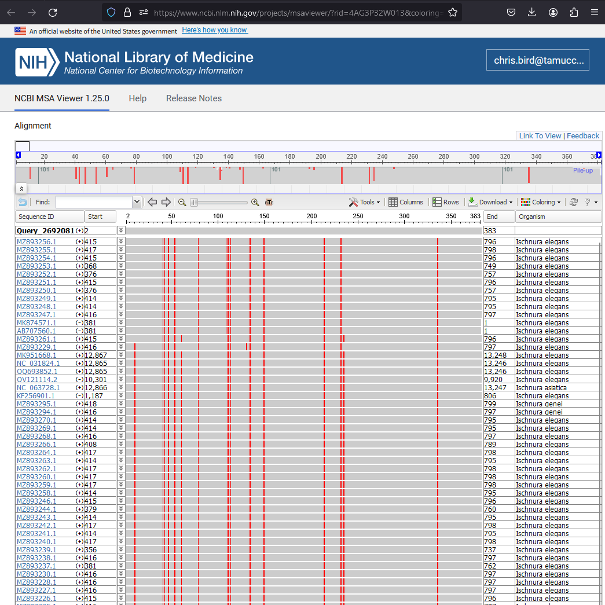

# prj_rotablue_barcoding: Scripts

---

## Copy raw data from `prj_rotablue_data`

_*This script needs to be made*_

Refer to https://github.com/orgs/opihi-partnership/repositories where a similar strategy has already been employed

---

## Processing Sanger Sequencing Reads

1. [Inspect chromatograms and edit `*.ab1` files](howto_edit_ab1.md)

2. Make consensus sequences from curated `*.ab1` files with `processCuratedAB1()` which is a function in `functions_sanger.R` and is applied in `ischnura_luta_phylogeny.R`

3. Cull sequences for your phylogeny from GenBank. Use a consensus sequence to query [NCBI Blast](https://blast.ncbi.nlm.nih.gov/Blast.cgi?PROGRAM=blastn&PAGE_TYPE=BlastSearch&LINK_LOC=blasthome) for the most similar sequences
   	* you can vary the number of records returned to increase or decrease the breadth of taxa in your phylogeny
	* on the blast output webpage, select MSA Viewer and download the aligned sequences in a fasta
	  

4. Use the [`wrangle_blast_output.bash`](wrangle_blast_output.bash) script to convert the information in the sequence names to tidy tsv format

   ```bash
   # wrangle_blast_output.bash ReplaceThisTextWithTheBlastMsaFastaFilePath > ReplaceThisTextWithTheNewFilePath.tsv
   wrangle_blast_output.bash ../output/sanger_curated_ab1_ischnura_luta_coi/blast_rbd_06_E1_500.fasta > ../output/sanger_curated_ab1_ischnura_luta_coi/blast_rbd_06_E1_500_better.tsv.tsv
   ```
5. Read the aligned NCBI blast sequences into R using the function `renameBlastFastaSeqs()` from `functions_sanger.R`
   	* See `ischnura_luta_phylogeny.R`

6. Concatenate the consensus and blast fasta files using `concatFastas()` from [phylogenetic_tools](https://github.com/Ph-IRES/phylogenetic_tools)
   	* See `ischnura_luta_phylogeny.R`

7. Deduplicate the sequences using `uniqueSeqsFastaFile()` from [phylogenetic_tools](https://github.com/Ph-IRES/phylogenetic_tools)

8. Align the sequences using `alignFastaFile()` from [phylogenetic_tools](https://github.com/Ph-IRES/phylogenetic_tools)

9. Use `fasta2tree()` from [phylogenetic_tools](https://github.com/Ph-IRES/phylogenetic_tools) to run modelTest, select best evolutionary model, and bootstrap a maximum likelihood phylogeny

10. Use `saveNewickTree()` from [phylogenetic_tools](https://github.com/Ph-IRES/phylogenetic_tools) to output the best maximum likelihood tree to file.

11. Use `figtree` to beautify the tree
