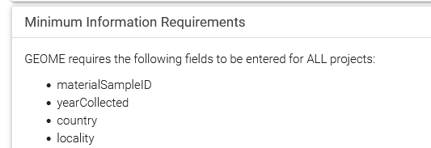
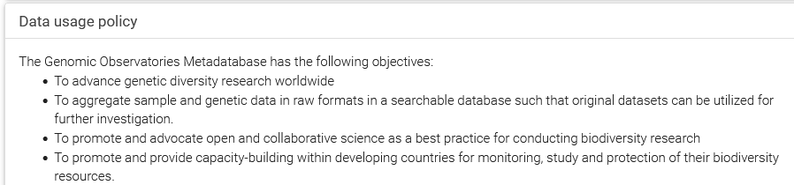

# Getting Acclimated to GEOME

1. Goto GEOME's [Getting Started Web Page](https://geome-db.org/about) and make an account. After creating your account, login.

	

2. [Watch John Deck describe how GEOME works](https://www.youtube.com/watch?v=cuAN9LbDO-U).  "This diagram shows how data is managed in the GEOME environment. Boxes in solid blue indicate GEOME functions that the user interacts with, such as generating templates and loading data. The white boxes with a green border are functions that happen outside of the GEOME environment, such as data entry into a spreadsheet."  
 
	

2. Return to GEOME's [Getting Started Web Page](https://geome-db.org/about) and read the

	* "Creating Projects & Expeditions" section.  
	
		* We will generally enter our data as part of the Diversity of the IndoPacific (DIPNet) Team

	* "Minimum Information Requirements" section
	

	* "Data usage policy" section
	

3. Read the [User Guide to Creating Local Identifiers](https://fims.readthedocs.io/en/latest/fims/identifiers.html), aka sample names.  Then discuss the local identifiers you want to use in your project with your mentor/advisor

	