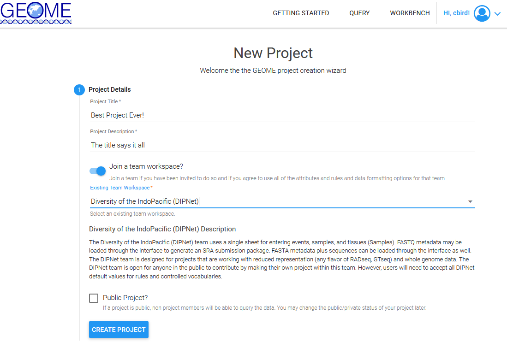
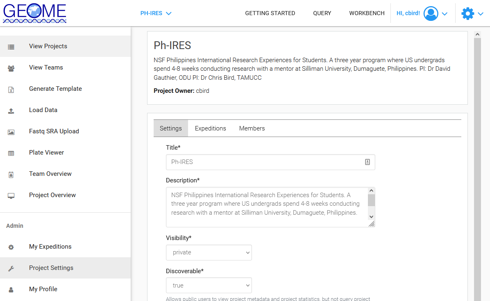
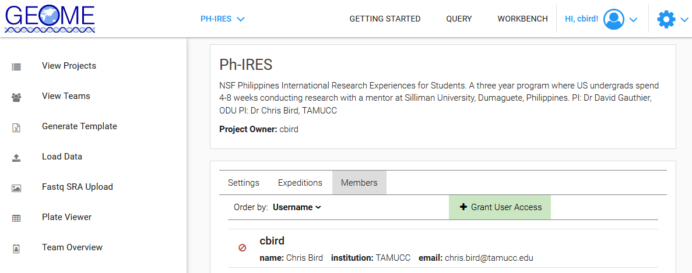
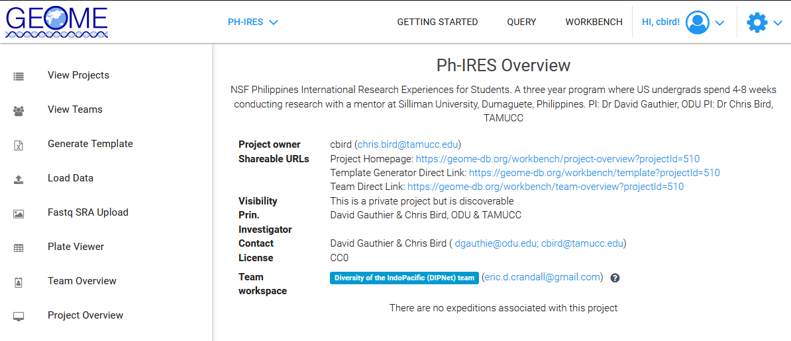

# Creating a New Project in GEOME in an Existing Team (DIPNet)

Consult with your mentor/advisor prior to creating a new project.  There may be a project that has already been created that you should use.

1. Goto GEOME's [Create a Project as Part of an Existing Team](https://geome-db.org/project/new) page. Consult with your mentor or advisor on the following information, then enter it and create a project. 

	

	* Project Title
	* Project Description
	* Select "Join a Team Workspace"
	* Existing team workspace (DIPNet)
	* Don't check "Public Project" right now, you can change it later.

2. After creating the project, you will be taken the to the "Workbench" . Select the [Project Settings](https://geome-db.org/workbench/project/settings) on the left panel, near the bottom, and edit the info under the "Settings" tab

	

	* Title: adjust as necessary
	* Description: good to list brief description of project, grant funding, and PIs
	* Visibility: private
	* Discoverable: true
	* Enforce Expedition Access Control: unchecked
	* ...  you may or may not want to fill in some of the fields depending upon whether 1 project = 1 publication, or not
	* License: CC0

3. Add project members under the "Members Tab" by clicking "+ Grant User Access"

	

	* Members must have a GEOME User Account. If they do not, GEOME will send them an invitation and automatically add them to the project upon account creation.

4. You can get links to share with project members in the [Project Overview](https://geome-db.org/workbench/project-overview) located in the left panel

	
