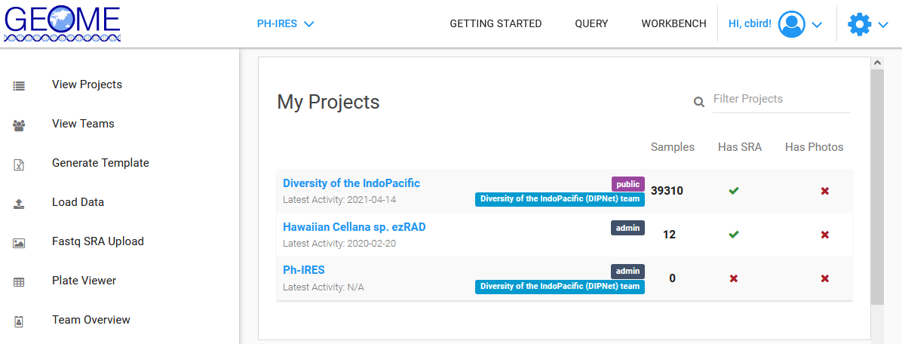
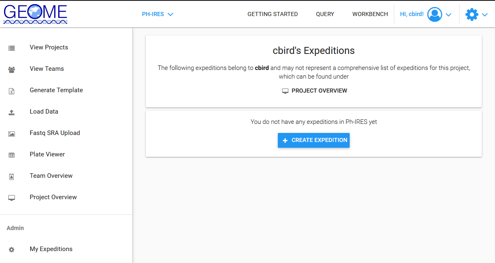
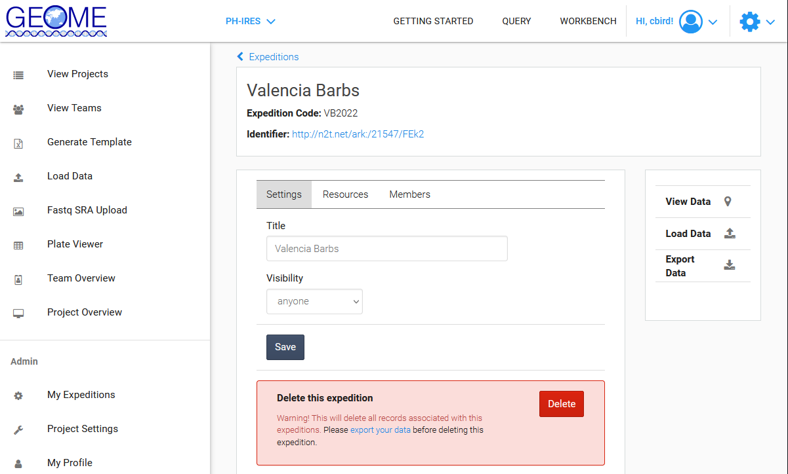

# Adding and Modifying Expeditions in an Existing Project

Consult with your mentor/advisor prior to creating a new expedition.  There may be an expedition that has already been created that you should use. 

1. Goto the [GEOME Workbench/View Projects Page](https://geome-db.org/workbench/dashboard) and select the project you want to add an expedition to.  

	

2. Create a new expedition by selecting [My Expeditions](https://geome-db.org/workbench/expeditions) in the left panel, and then selecting "+ CREATE EXPEDITION" if your expedition does not exist yet

	

	* Name your expedition
	
	* Enter your expedition code

3. Edit an existing expedition by selecting [My Expeditions](https://geome-db.org/workbench/expeditions) in the left panel, and then selecting the expedition

	* Be sure to change the visibility for unpublished data to `project members`  not `visible`

	
