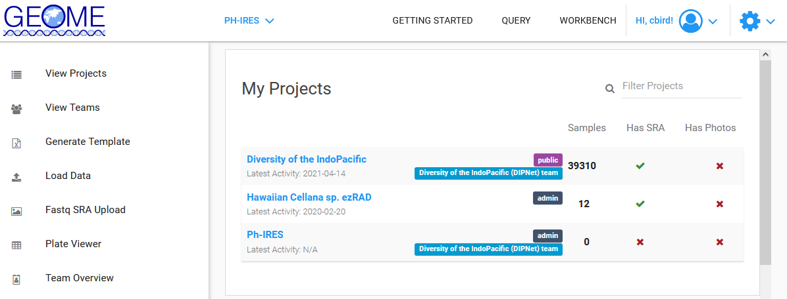

# Creating a MetaData Template & Entering the Data (DNA Data = FASTA)

Consult with your mentor/advisor prior to creating a new template.  There may be a template that has already been created that you should use.

1. Goto the [GEOME Workbench/View Projects Page](https://geome-db.org/workbench/dashboard) and select the project you want to add an expedition to.  

	

2. Select [Generate Template](https://geome-db.org/workbench/template) 

	

	* Template Config: DEFAULT
	* Select each field (column) you want in your metadata template worksheet
		* if you are unsure of the meaning of a field name, click the "DEF" link
	* Select "EXPORT EXCEL"

3. Open the Excel file and read the "Instructions" worksheet. Here are some highlights:
	
	* Only edit the "Samples" worksheet, do not edit any other worksheet.
	* Red fields (columns) are required
	* Some fields can only accept certain values, these are listed in the "Lists" worksheet.  Do not edit the data in "Lists". 
	* The "Samples_Fields" worksheet has the definition of each field and indicates whether there is "controlled vocabulary", ie you must use the terms in the "Lists" worksheet, or if each row requires a unique id.

4. Enter your data in the "Samples" worksheet.

	* generally, each row has the information for one individual, but this is not always the case. Consult with your mentor/advisor if you are unsure
	* make sure identify the columns that require unique values in each row and label them accordingly
		* generally, the `materialSampleID` must match the FASTA sequence name exactly
		* if you have multiple loci, there must be one FASTA for each locus. This means that the FASTA sequence names must be identical among loci. You can differentiate loci by file name.
	* try to fill in every field for every row of data, avoid blanks
	* use the Data/Filter excel option to view all entries for each field and correct spellings as necessary
	* if you have more than one entry for a field, delimit the entries with `bash` pipes, i.e. `|`
	* do not use [new line characters](https://en.wikipedia.org/wiki/Newline) such as [carriage returns](https://en.wikipedia.org/wiki/Carriage_return) or [line feeds](https://en.wikipedia.org/wiki/Newline#Representation)
	* do not edit the field (column) names
