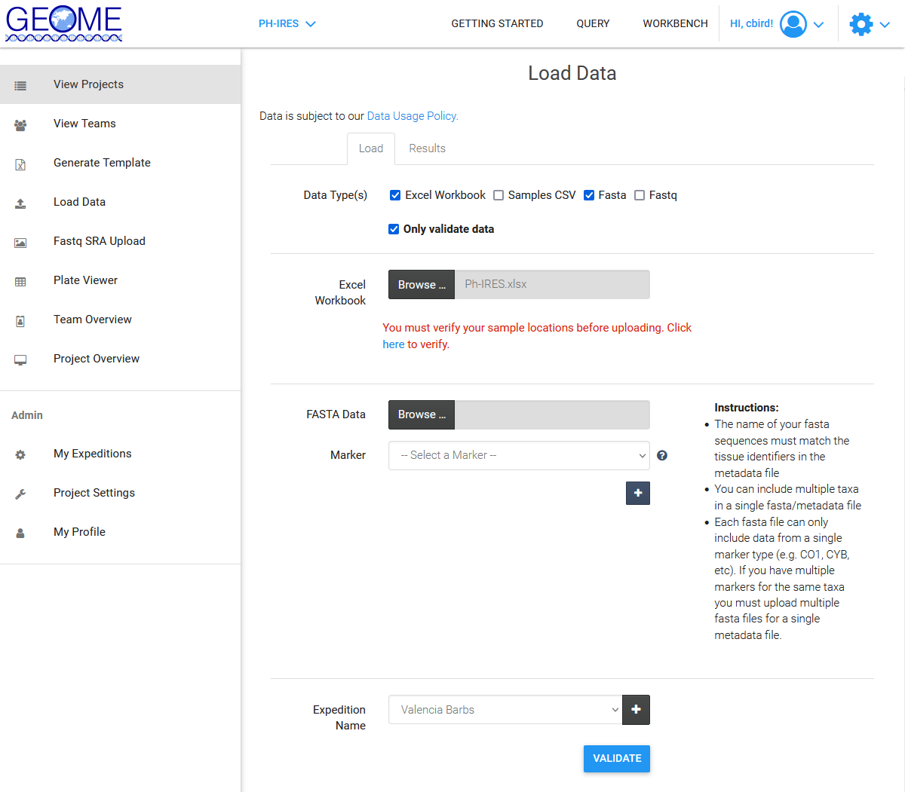

# Validating and Loading Data in GEOME (DNA Data = FASTA)

1. Goto the [GEOME Workbench/View Projects Page](https://geome-db.org/workbench/dashboard) and select the project you want to add an expedition to.  

	

2. Select [Load Data](https://geome-db.org/workbench/upload) in the left panel and validate your metadata

	
	
	* Select "Excel Workbook" and FASTA
	* Select "Only validate data"
	* Browse to the metadata sheet
	* Browse to each DNA file (one per marker)
	* Verify the locations 
	* Select the Expedition name
	* Select Validate
	* Edit the metadata in the excel workbook and/or FASTA files and repeat as necessary until you pass the validation

3. Load data by repeating step 2, but don't check "Only Validate Data"
