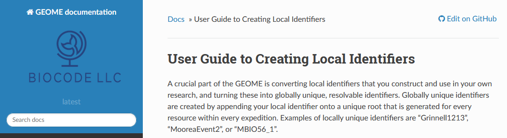
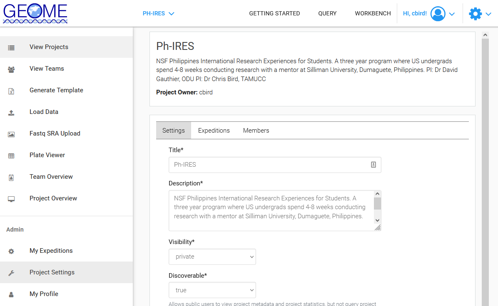
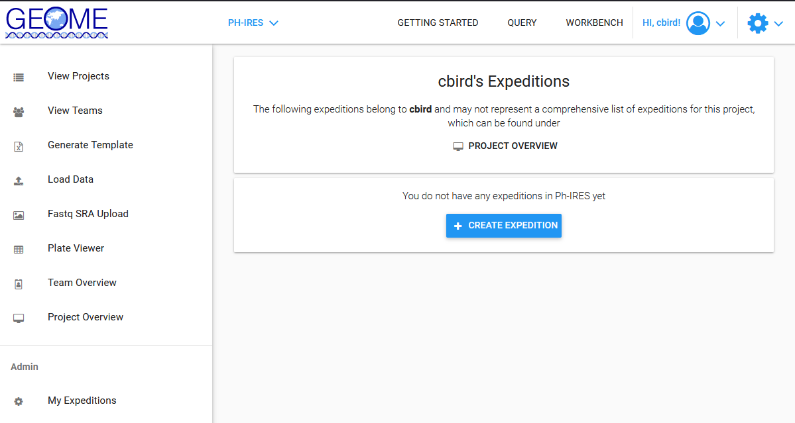
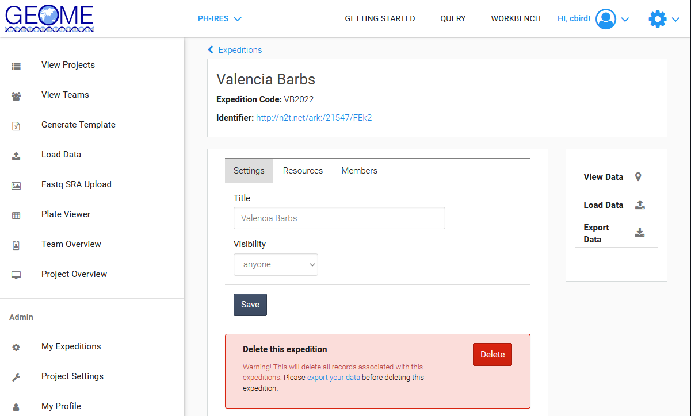

# Submitting DNA Data to NCBI GenBank and MetaData to GEOME DataBase

We will use the [GEOME](https://geome-db.org/) suite of tools to submit our DNA sequences and the associated metadata to both the GEOME Database as well as [NCBI GenBank](https://www.ncbi.nlm.nih.gov/). 

[NCBI GenBank](https://www.ncbi.nlm.nih.gov/) houses DNA sequence data, but very little associated metadata for those sequences that we typically generate in projects focused on moleculary ecology, evolution, and conservation genetics.  That's where the [GEOME DataBase](https://geome-db.org/) comes in, storing metadata that GenBank won't accept and linking that metadata to the DNA sequences in GenBank.  

You can read more about GEOME here:
["The Genomic Observatories Metadatabase (GEOME): A new repository for field and sampling event metadata associated with genetic samples", John Deck , Michelle R. Gaither, Rodney Ewing, Christopher E. Bird, Neil Davies, Christopher Meyer, Cynthia Riginos, Robert J. Toonen, Eric D. Crandall](https://doi.org/10.1371/journal.pbio.2002925)

---

## Getting Acclimated to GEOME

1. Goto GEOME's [Getting Started Web Page](https://geome-db.org/about) and make an account. After creating your account, login.

	

2. [Watch John Deck describe how GEOME works](https://www.youtube.com/watch?v=cuAN9LbDO-U).  "This diagram shows how data is managed in the GEOME environment. Boxes in solid blue indicate GEOME functions that the user interacts with, such as generating templates and loading data. The white boxes with a green border are functions that happen outside of the GEOME environment, such as data entry into a spreadsheet."  
 
	

2. Return to GEOME's [Getting Started Web Page](https://geome-db.org/about) and read the

	* "Creating Projects & Expeditions" section.  
	
		* We will generally enter our data as part of the Diversity of the IndoPacific (DIPNet) Team

	* "Minimum Information Requirements" section
	

	* "Data usage policy" section
	

3. Read the [User Guide to Creating Local Identifiers](https://fims.readthedocs.io/en/latest/fims/identifiers.html), aka sample names.  Then discuss the local identifiers you want to use in your project with your mentor/advisor

	

---

## Creating a New Project in GEOME in an Existing Team (DIPNet)

Consult with your mentor/advisor prior to creating a new project.  There may be a project that has already been created that you should use.

1. Goto GEOME's [Create a Project as Part of an Existing Team](https://geome-db.org/project/new) page. Consult with your mentor or advisor on the following information, then enter it and create a project. 

	

	* Project Title
	* Project Description
	* Select "Join a Team Workspace"
	* Existing team workspace (DIPNet)
	* Don't check "Public Project" right now, you can change it later.

2. After creating the project, you will be taken the to the "Workbench" . Select the [Project Settings](https://geome-db.org/workbench/project/settings) on the left panel, near the bottom, and edit the info under the "Settings" tab

	

	* Title: adjust as necessary
	* Description: good to list brief description of project, grant funding, and PIs
	* Visibility: private
	* Discoverable: true
	* Enforce Expedition Access Control: unchecked
	* ...  you may or may not want to fill in some of the fields depending upon whether 1 project = 1 publication, or not
	* License: CC0

3. Add project members under the "Members Tab" by clicking "+ Grant User Access"

	

	* Members must have a GEOME User Account

4. You can get links to share with project members in the [Project Overview](https://geome-db.org/workbench/project-overview) located in the left panel

	

---

## Adding and Modifying Expeditions in an Existing Project

Consult with your mentor/advisor prior to creating a new expedition.  There may be an expedition that has already been created that you should use.

1. Goto the [GEOME Workbench/View Projects Page](https://geome-db.org/workbench/dashboard) and select the project you want to add an expedition to.  

	

2. Create a new expedition by selecting [My Expeditions](https://geome-db.org/workbench/expeditions) in the left panel, and then selecting "+ CREATE EXPEDITION" if your expedition does not exist yet

	

	* Name your expedition
	
	* Enter your expedition code

3. Edit an existing expedition by selecting [My Expeditions](https://geome-db.org/workbench/expeditions) in the left panel, and then selecting the expedition

	

---

_Note: for issues/topics not covered here, you can consult the [GeOMe User Guide](https://docs.google.com/document/d/1j94NWlrcwu85xGaRda98SSTpRFgRg_RcrYG4Qs5CB1w/edit?usp=sharing), [FAQ](https://docs.google.com/document/d/1tEFpclCyJ6aLnypmtdfdjLVhiWQ-rYhGqu5eGhq3s5s/edit?usp=sharing), and [Help Document](https://geome-db.org/docs/helpDocumentation.pdf)_

