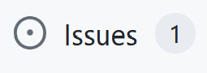

# GitHub Issues - A Short Tutorial

## Introduction

Issues are a great way to keep track of tasks, enhancements, and bugs for your projects on GitHub. They are kind of like email, except they can be shared and discussed with the rest of your team. This guide will walk you through creating and managing issues.

## How to Create an Issue

1. Navigate to the main page of your repository.
2. Under your repository name, click the "Issues" tab.

3. Click on the green "New issue" button.
4. Give your issue a title and a description. The title should succinctly describe the problem, and the description should provide as much detail as necessary to understand and resolve the issue.
5. (Optional) Assign the issue to someone, add labels, or link a pull request.
6. Click "Submit new issue".

## Assigning Issues

Assigning issues helps to make clear who is responsible for resolving the issue. To assign an issue:

1. Navigate to the issue you want to assign.
2. In the "Assignees" section to the right of the issue, click the gear icon.
3. In the dropdown, select the name of the person you want to assign the issue to.

## Labelling Issues

Labels help to categorize and filter issues. To add a label to an issue:

1. Navigate to the issue you want to label.
2. In the "Labels" section to the right of the issue, click the gear icon.
3. In the dropdown, select the labels you want to add to the issue.

## Closing Issues

Once an issue has been resolved, it can be closed. To close an issue:

1. Navigate to the issue you want to close.
2. At the bottom of the issue, click the "Close issue" button.

Remember, issues are a communication tool. Make sure to use them to facilitate clear and effective dialogue about your project.

