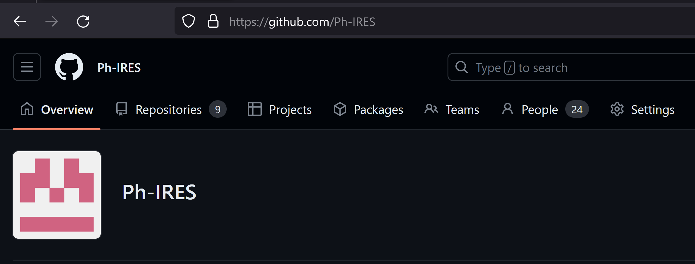

# Tutorial: Make GitHub Repo from Template

This tutorial is for the Ph-IRES program participants.

---

# Step by Step Instrucions

## 1. Goto the [Ph-IRES Organization on GitHub](https://github.com/Ph-IRES)


	
---

## 2. Click on the green `New` button


---

## 3. Select the template repo shown below


	
---

## 4. Name your repo according the provided naming convention.  You can also look at other repos for examples.


	
---

## 5. Make sure repo is private and select the green `Create repository` button

---

## 6. Clone the repo to your computer

* Using your terminal (could be either the stand alone app or in RStudio) navigate to the directory you want to download you repo to.

```
# mac
cd ~

# win
cd Downloads
```

---

## 7. Navigate to your repo on GitHub ([Ph-IRES Organization on GitHub](https://github.com/Ph-IRES)) and copy the SSH link from the green `Code` button


---

## 8. Back in your terminal clone your Repo

```
git clone PasteLinkHere
```

## 9. Copy one of your data files into the data directory of your repo on your computer

Mac users can use the mac finder and win users can use the win explorer.  If you know how, you could also use the terminal to accomplish this.

## 10. Log you changes to the repo in the terminal

```
# goto your repo directory

cd NameOfYourRepo

# stage changes to your repo on your computer

git add --all

# commit those changes to your repo on your computer

git commit -m "added my first data file"

# push the changes to GitHub

git push
```

---

## 11. On GitHub, confirm that the data file was added

---

# 12. On GitHub, modify your README.md file in the main repo directory

---

# 13.  Pull the changes you made to your repo on GitHub to the copy of your repo on your computer in the terminal.

```
git pull
```

---

# 14. Confirm changes made on GitHub are now on you computer

---

# Why Use GitHub for Your Biology Research?

GitHub provides a platform for version control and collaboration that can enhance the management, sharing, and reproducibility of your research, including both data and R scripts. Here are a few reasons why you should consider using GitHub:

## 1. Version Control
GitHub provides a record of all changes made to a file or set of files over time. This allows you to track your progress and revert to a previous version if necessary. This is especially helpful when working with complex scripts or large datasets, as it can prevent data loss and facilitate troubleshooting.

## 2. Collaboration
GitHub can make collaboration easier by allowing multiple people to work on the same project simultaneously. This is useful if you're part of a research team or collaborating with other scientists. Everyone can make their own changes and then merge them together, with GitHub keeping track of who made what changes.

## 3. Reproducibility
One of the key issues in scientific research is reproducibility. By using GitHub, you can ensure that your scripts and data are available for others to validate your results or build upon your work. This openness is not only good scientific practice, but it can also enhance your reputation within the scientific community.

## 4. Documentation
GitHub allows for thorough documentation of your project. This can be particularly helpful when returning to a project after some time has passed. This is also beneficial for others looking at your project, as it provides context and helps them understand your workflow and the choices you've made.

## 5. Showcase Work
GitHub also serves as a portfolio of your work, and can be a great way to showcase your skills and projects to potential employers or collaborators.

## 6. Integration with other tools
GitHub works well with many other tools used in data science and bioinformatics. For example, if you're using R, you can take advantage of RStudio's built-in tools for version control with Git.

Remember that while GitHub can be very useful, it also requires learning some new skills, particularly around the Git command line interface. If you're new to version control or Git, it may take some time to get up to speed, but the long-term benefits to your research and data management practices can be substantial.

---

# Why Use GitHub over Dropbox or Google Drive?

While Dropbox and Google Drive offer simple, easy-to-use platforms for storing and sharing files, they are fundamentally different from GitHub and lack some key features that are critical for effective code and data management. Here's why GitHub may be more suitable for your needs as a biologist working with data and R scripts:

## 1. Version Control
While Dropbox and Google Drive do have version history, they don't offer a robust version control system like GitHub does. GitHub uses Git, a distributed version control system that allows you to track and manage changes to your projects. It allows for granular control over changes and is much more powerful than the simple version history found in Dropbox or Google Drive.

## 2. Collaboration on Code
GitHub is specifically designed for code collaboration, with features like pull requests and code reviews that make it easier to work together on software projects. While Dropbox and Google Drive allow for simultaneous collaboration on certain file types (like Google Docs), they aren't designed to handle simultaneous edits to code files.

## 3. Code Review and Accountability
Each commit on GitHub is tied to an account, which allows for clear accountability of who made what changes. This can be particularly helpful in a collaborative project.

## 4. Reproducibility and Open Science
With GitHub, you can make your code and data publicly accessible, making it easier for others to reproduce your results or build upon your work. This can also foster a more open and collaborative scientific community.

## 5. Integration with Coding Platforms
GitHub integrates well with programming environments like RStudio or Jupyter notebooks, and other continuous integration/continuous delivery (CI/CD) platforms. This can streamline your workflow and make you more productive.

## 6. Documentation
GitHub's READMEs and wikis allow for thorough documentation of your projects, helping others understand and use your work.

However, keep in mind that there can be a learning curve when you first start using GitHub, especially if you're not already familiar with version control systems. Additionally, for large datasets, you might still need a data storage solution like Dropbox or Google Drive due to GitHub's file size limits. Therefore, a combination of these tools might be the most effective solution depending on your specific needs.

---

