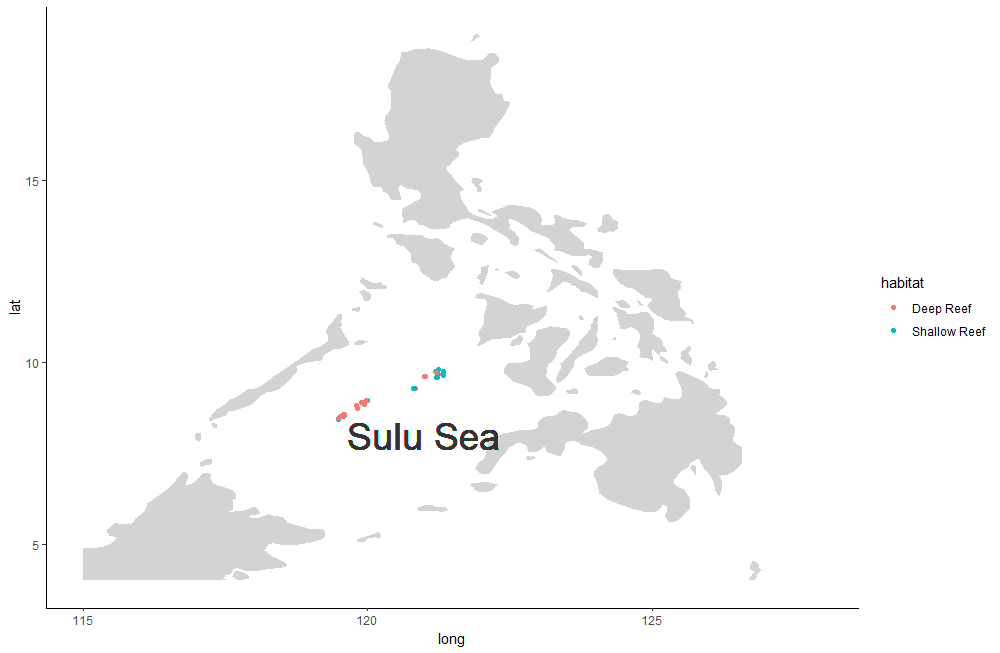

# Making Maps with R Using `ggplot2`

In your local copy of the `workshop_data-analysis` repo, open [tutorial_r_maps/data_mapping.R](data_mapping.R) in R Studio and execute the code line by line for examples of how to make maps.  The code used to make the last map is universal and can be copied and pasted into your own code.

While this tutorial is focused on making maps, new data wrangling concepts may also be employed.
