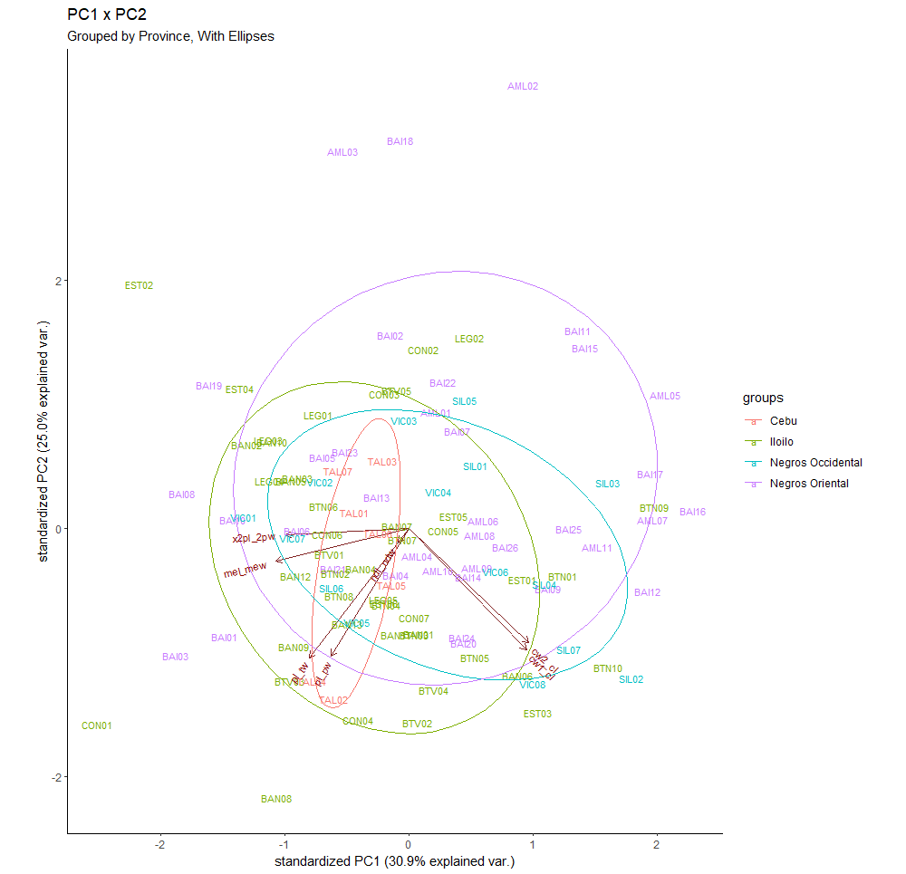

## PRINCIPLE COMPONENTS ANALYSIS (PCA)

Background links:

* https://en.wikipedia.org/wiki/Principal_component_analysis


## Tutorial

This tutorial was modeled after [that of datacamp](https://www.datacamp.com/tutorial/pca-analysis-r#!)

We will use Jerome's crab morphometric ratio data instead of the data used in the data camp tutorial.

1. First, in your local copy of the `workshop_data-analysis` repo, open `data_wrangling_vis.R` in R studio

2. Then run lines 1-56 in `data_wrangling_vis.R`.  This will create the tibble `data_lai_ratios` from his excel data.  This will be used for the PCA

3. Run the Principle Components Analysis with `prcomp()`, store the results in a variable called `lai_ratio.pca`, and use `summary()` to view the results.

```r
lai_ratio.pca <- 
  prcomp(data_lai_ratios %>%
           select(-code:-baranguay,
                  -mal_dal), 
         center = TRUE,
         scale. = TRUE)

summary(lai_ratio.pca)
```

You should obtain the following output:

	```
	Importance of components:
							  PC1    PC2    PC3    PC4     PC5     PC6     PC7
	Standard deviation     1.4712 1.3224 1.0537 0.9929 0.67605 0.57038 0.45645
	Proportion of Variance 0.3092 0.2498 0.1586 0.1409 0.06529 0.04648 0.02976
	Cumulative Proportion  0.3092 0.5590 0.7176 0.8585 0.92376 0.97024 1.00000
	```

PC1 is Principle Component 1, which will always explain the most variance (stdev is sqrt(variance)).

4. Now we use `ggbiplot()` to visualize the results stored in `lai_ratio.pca`.  Note that we demonstrate a few different features of `ggbiplot()` and that it works with typical `ggplot` functions.

```r
ggbiplot(lai_ratio.pca) +
  theme_classic() +
  labs(title = "PC1 x PC2")
```


```r
ggbiplot(lai_ratio.pca,
         labels = data_lai_ratios %>%
           pull(code)) +
  theme_classic() +
  labs(title = "PC1 x PC2",
       subtitle = "Labeled with ID #s")
```


```r
ggbiplot(lai_ratio.pca,
         labels = data_lai_ratios %>%
           pull(code),
         ellipse = TRUE,
         groups = data_lai_ratios %>%
           mutate(province = str_remove(baranguay,
                                        "^.*, ")) %>%
           pull(province)) +
  theme_classic() +
  labs(title = "PC1 x PC2",
       subtitle = "Grouped by Province, With Ellipses")
```



```r
ggbiplot(lai_ratio.pca,
         labels = data_lai_ratios %>%
           pull(code),
         ellipse = TRUE,
         groups = data_lai_ratios %>%
           mutate(province = str_remove(baranguay,
                                        "^.*, ")) %>%
           pull(province),
         choices = c(3,4)) +
  theme_classic() +
  labs(title = "PC3 x PC4",
       subtitle = "Grouped by Province, With Ellipses")
```


```r
ggbiplot(lai_ratio.pca,
         labels = data_lai_ratios %>%
           pull(code),
         ellipse = TRUE,
         groups = data_lai_ratios %>%
           mutate(province = str_remove(baranguay,
                                        "^.*, ")) %>%
           pull(province),
         choices = c(3,4),
         var.axes = FALSE) +
  theme_classic() +
  labs(title = "PC3 x PC4",
       subtitle = "Grouped by Province, With Ellipses, Variables Removed")
```


---

## Dealing With Missing Data

PCA (Principal Component Analysis) cannot handle missing values directly, and by default, the prcomp function in R will throw an error if you try to apply it to data with missing values. However, you have multiple ways to deal with missing values in PCA:

---

### Imputation: 

You can fill in the missing values with some reasonable values. The choice of these values can be quite complex and depends on the specific application. Common choices are using the mean, median, or mode of the available data for that variable. The mice package in R provides several methods for imputing missing data.

```r
# Impute missing values with column mean
data_lai_ratios_imputed <- data_lai_ratios %>%
  mutate(across(where(is.numeric), ~replace(., is.na(.), mean(., na.rm = TRUE))))

# Perform PCA
pca_result <- data_lai_ratios_imputed %>%
  select(-code, -baranguay) %>%
  prcomp(center = TRUE, scale. = TRUE)

```

In the code above:

    The mutate() function is used to change values in the dataset.
    The across() function is used to apply a function across multiple columns.
    The where(is.numeric) function is used to select only the numeric columns.
    The replace() function is used to replace the NA values in each numeric column with the mean of that column (calculated with mean(., na.rm = TRUE)).

This will replace all NA values in each numeric column with the mean of the non-missing values in that column.

After the imputation, we perform PCA using prcomp() on the numerical columns only. We use select(-code, -baranguay) to exclude the non-numerical columns code and baranguay from the PCA.

Please be aware that mean imputation is a simple method and may not always be the best choice, depending on the nature of your data and the reason for the missingness. Other imputation methods might give better results in some cases. The 'mice' or 'missMDA' packages in R provide more advanced imputation method

---

### PCA on available data (Complete-Case Analysis): 
You can do the PCA on just the complete cases, that is, the observations without any missing data. This can be done in R by using na.omit() function.  Above, we used the `select()` function to accomplish this.

```R

# Example
pca_result <- prcomp(na.omit(data_lai_ratios), center = TRUE, scale. = TRUE)
```

---

### Multiple Imputation: 

This is a more advanced method, where instead of filling in a single value, you fill in the missing values multiple times, creating several different "complete" datasets. You then perform your analysis (like PCA) on each of these datasets and combine the results. This gives you a measure of the uncertainty of your analysis due to the missing data.

---

### Missing value imputation for PCA: 

You can also use the package missMDA in R, which provides a way to estimate the missing data for PCA.

Here is an example of using missMDA package:

```R

# Install and load the package
install.packages("missMDA")
library(missMDA)

# Estimate the number of dimensions
nb <- estim_ncpPCA(data_lai_ratios[, -c(1:2)])

# Impute the missing values
imputed_data <- imputePCA(data_lai_ratios[, -c(1:2)], ncp = nb$ncp)

# Now use this data in your PCA
pca_result <- prcomp(imputed_data$completeObs, center = TRUE, scale. = TRUE)
```

Remember, dealing with missing data always involves making assumptions, and there's no one-size-fits-all solution. The appropriate method depends on why the data is missing and the specific characteristics of your dataset.
User
